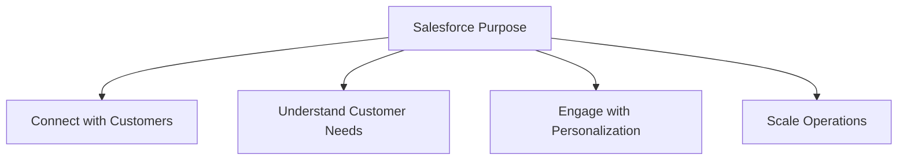
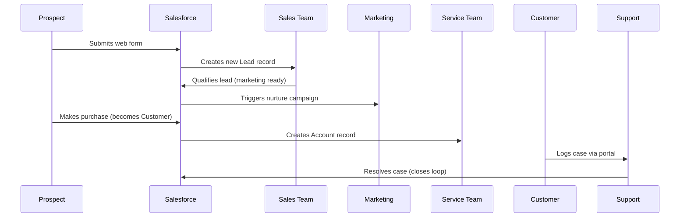
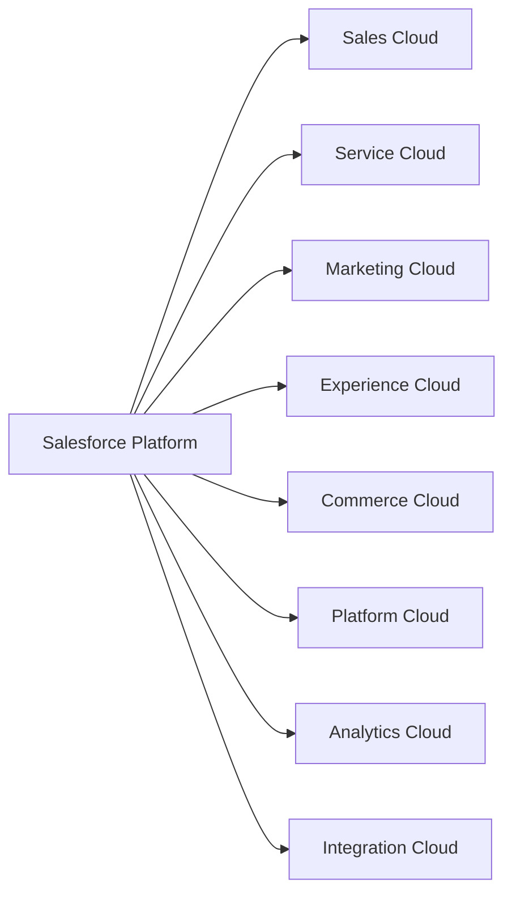
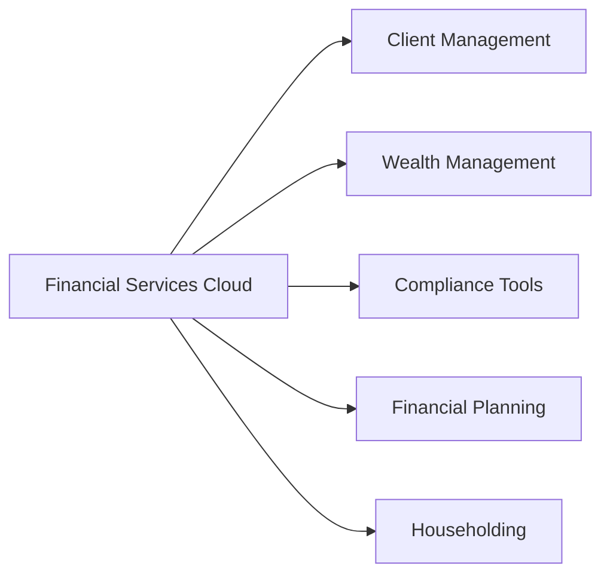
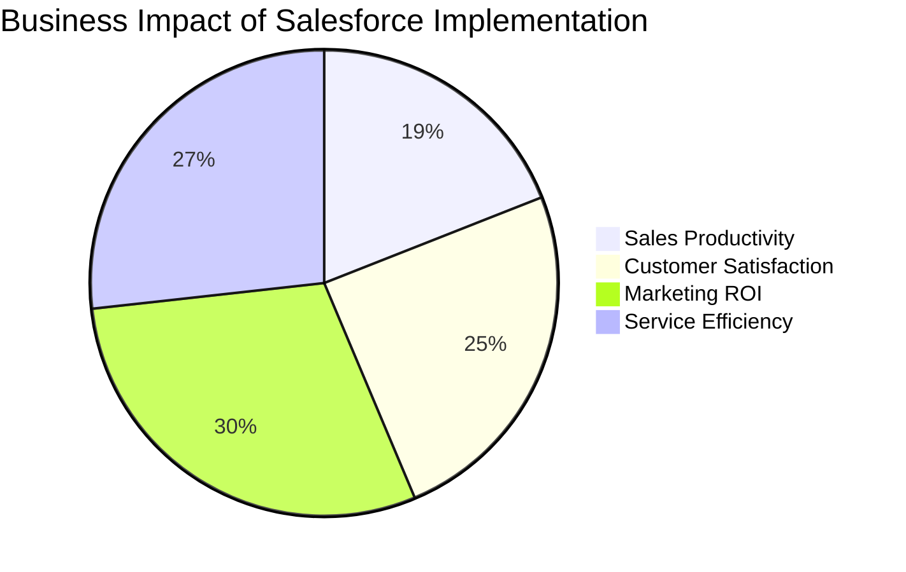
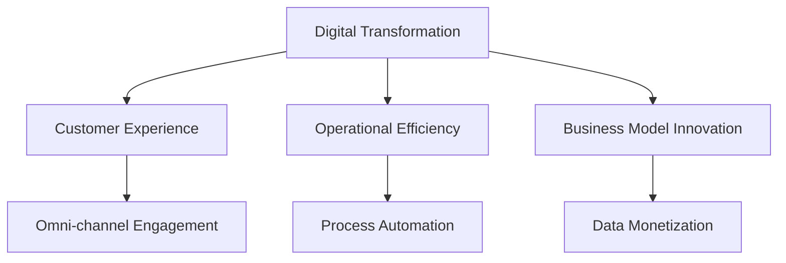
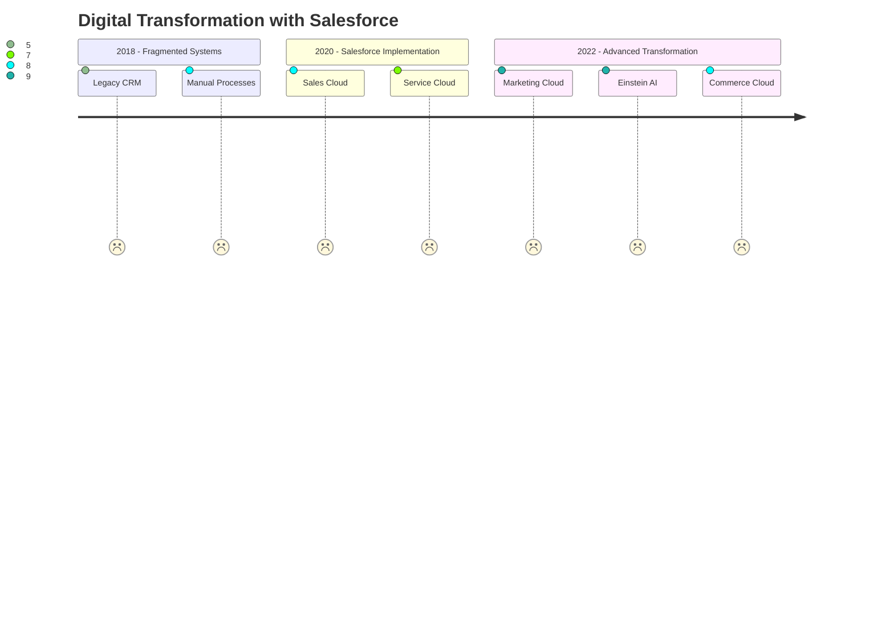
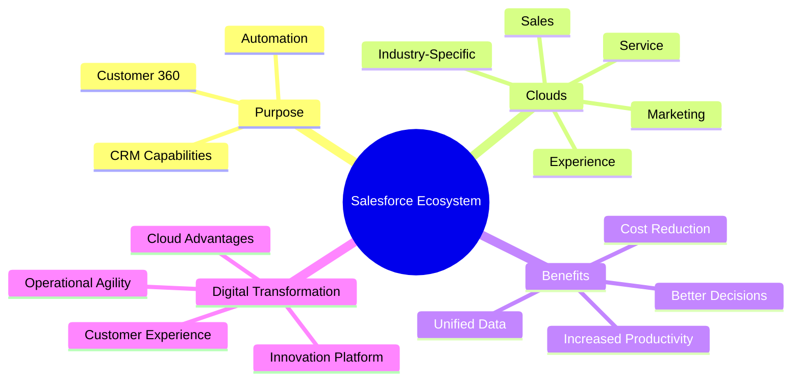

## 1. Purpose of Salesforce and its CRM Capabilities

### Core Purpose of Salesforce
Salesforce is a cloud-based CRM platform designed to help businesses:
- **Connect** with customers across multiple channels
- **Understand** customer needs through data insights
- **Engage** with personalized experiences
- **Scale** operations efficiently through automation

### Key CRM Capabilities
| Capability | Description | Real-World Example |
|------------|-------------|-------------------|
| **Contact Management** | Centralized database for customer information | Stores contact details, communication history, and preferences |
| **Lead Management** | Tracking potential customers through sales funnel | Automating lead assignment based on territory rules |
| **Opportunity Tracking** | Managing sales deals through stages | Visual pipeline showing deal value and close probability |
| **Case Management** | Handling customer service requests | Prioritizing cases based on severity and SLAs |
| **Reporting & Analytics** | Generating insights from customer data | Sales performance dashboard updated in real-time |

**Unique Salesforce CRM Features:**
- **360° Customer View**: Unified profile showing all interactions across departments
- **Artificial Intelligence (Einstein)**: Predictive lead scoring and automated insights
- **Mobile Accessibility**: Full CRM functionality on any device
- **AppExchange**: Marketplace for 5000+ pre-built integrations

*Example Workflow: Customer Journey*

## 2. Understanding Salesforce Clouds

### Core Cloud Products

#### Sales Cloud
- **Purpose**: Automate sales processes and accelerate deals
- **Key Features**:
  - Opportunity management
  - Sales forecasting
  - Quotes and contracts
  - Territory management
  - Einstein Sales Insights
- **Use Case**: Sales team tracking $500K deal through stages with automated reminders

#### Service Cloud
- **Purpose**: Deliver exceptional customer service
- **Key Features**:
  - Omni-channel routing
  - Case management
  - Knowledge base
  - Field Service Lightning
  - Service analytics
- **Use Case**: Support agent resolving cases via chat, email, and phone from single console

#### Marketing Cloud
- **Purpose**: Create personalized customer journeys
- **Key Features**:
  - Email studio
  - Journey builder
  - Advertising studio
  - Social studio
  - DMP (Data Management Platform)
- **Use Case**: Automated birthday email with discount coupon triggering purchase

#### Experience Cloud
- **Purpose**: Build branded communities
- **Key Features**:
  - Customer portals
  - Partner portals
  - Employee communities
  - Self-service portals
  - Content management
- **Use Case**: Partner portal for 500+ distributors to access training and sales materials

#### Other Key Clouds
| Cloud | Purpose | Key Benefit |
|-------|---------|-------------|
| **Commerce Cloud** | Unified shopping experiences | B2B/B2C commerce on single platform |
| **Platform Cloud** | Custom app development | Low-code development environment |
| **Analytics Cloud** | Business intelligence | AI-powered insights and dashboards |
| **Integration Cloud** | Connect systems | API-led connectivity (MuleSoft) |

### Industry-Specific Clouds
- Health Cloud
- Financial Services Cloud
- Manufacturing Cloud
- Nonprofit Cloud
- Education Cloud

*Example: Financial Services Cloud*

## 3. Benefits of Using Salesforce for Business Operations

### Operational Benefits Matrix
| Benefit Category | Impact | Real-World Result |
|------------------|--------|------------------|
| **Unified Data** | Single source of truth | 40% reduction in data duplication |
| **Automation** | Workflow automation | 30% time savings on manual processes |
| **Mobility** | Anytime/anywhere access | 25% increase in field productivity |
| **Scalability** | Flexible growth | Support 2X users without infrastructure change |
| **Collaboration** | Cross-team visibility | 50% faster case resolution |

### Quantitative Impact Analysis

### Strategic Advantages
1. **Customer-Centric Operations**
   - 360° view enables personalized engagement
   - Example: Bank recognizing life events (marriage, home purchase) to offer relevant products

2. **Agile Business Processes**
   - Drag-and-drop process builder
   - Example: Insurance company reducing claim approval time from 5 days to 4 hours

3. **Data-Driven Decision Making**
   - Real-time dashboards and predictive analytics
   - Example: Retailer using Einstein to forecast inventory needs with 95% accuracy

4. **Ecosystem Integration**
   - 3,000+ pre-built AppExchange solutions
   - Example: Seamless ERP integration eliminating manual data entry

5. **Continuous Innovation**
   - 3 major releases/year with automatic updates
   - Example: Adopting AI features without upgrade projects

## 4. Salesforce's Role in Digital Transformation and Cloud Computing

### Digital Transformation Framework

### Salesforce as Transformation Engine
| Transformation Stage | Salesforce Capabilities | Business Outcome |
|----------------------|------------------------|-----------------|
| **Customer Connect** | Marketing Cloud + Service Cloud | 35% increase in customer retention |
| **Process Digitization** | Platform Cloud + Automation | 50% faster process execution |
| **Data Utilization** | Analytics Cloud + Einstein AI | Predictive insights driving 20% revenue growth |
| **Ecosystem Expansion** | Experience Cloud + APIs | New partner revenue streams |

### Cloud Computing Advantages
**Why Salesforce Embodies Cloud Benefits:**
- **Multi-Tenant Architecture**: Shared infrastructure = lower costs + faster innovation
- **Global Scale**: 100+ data centers worldwide with 99.99% uptime
- **Security**: Enterprise-grade protection with regular compliance certifications
- **Subscription Model**: OPEX vs CAPEX financial flexibility

*Example Transformation Journey: Retail Company*

### Future Trends Enabled
1. **Hyper-Personalization**: AI-driven individual experiences
2. **IoT Integration**: Connected products feeding service insights
3. **Blockchain Applications**: Secure contract management
4. **Voice Interface**: Natural language CRM interactions
5. **Predictive Service**: Resolving issues before customers notice

## Study Summary Cheat Sheet

### Key Certification Exam Tips:
1. Remember cloud-specific capabilities (Service Cloud = case management)
2. Associate benefits with business outcomes (automation → time savings)
3. Identify transformation stages in scenario questions
4. Recognize cloud computing characteristics (multi-tenant, subscription model)
5. Connect features to customer experience improvements
