## 1. Navigating Salesforce Lightning Experience

### Core Navigation Components
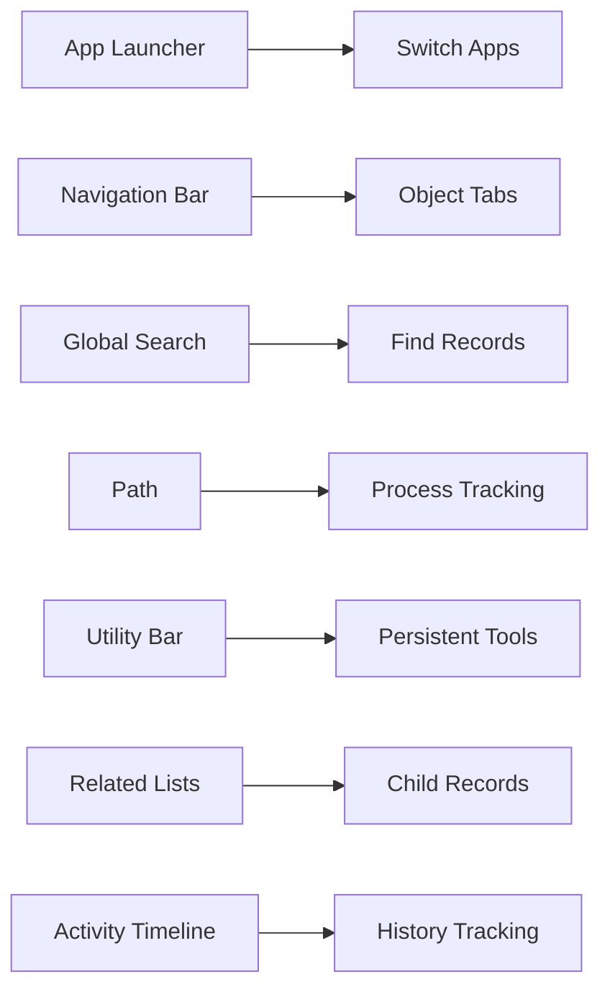

### Key Areas & Navigation Techniques:
- **App Launcher (9-dot menu)**:
  - Access all apps (Sales, Service, custom)
  - Pin frequently used apps
  - Example: Switch between Sales app and Service Console
  
- **Navigation Tabs**:
  - Standard objects (Accounts, Contacts)
  - Custom tabs (Projects, Assets)
  - Reorder tabs via personal setup
  
- **Global Actions (+)**:
  - Quick record creation from any page
  - Create Tasks, Events, Log Calls
  - Customizable for frequent actions
  
- **List View Management**:
  - Filter records (e.g., "My Open Cases")
  - Create public/private views
  - Bulk edit records directly

- **Record Navigation**:
  - Use breadcrumbs to navigate hierarchy
  - Tab between related records
  - Recently viewed items dropdown

### Navigation Best Practices:
1. **Personalize Navigation**:
   ```mermaid
   flowchart LR
       A[App Launcher] --> B[Edit Apps]
       B --> C[Add Custom Tabs]
       C --> D[Rearrange Items]
       D --> E[Save as Default]
   ```
2. Use **Keyboard Shortcuts**:
   - `/` = Focus search bar
   - `Ctrl + K` = Global search (Windows)
   - `Ctrl + Enter` = Save record
3. **Bookmark Key Pages**:
   - Save reports/dashboards to browser
   - Use "Add to Favorites" in Setup

---

## 2. Objects: Standard vs. Custom

### Comparison Table
| Feature | Standard Objects | Custom Objects |
|---------|------------------|----------------|
| **Origin** | Salesforce-provided | User-created |
| **Naming** | No suffix | Requires `__c` suffix |
| **Examples** | Account, Contact, Opportunity | Project__c, Invoice__c |
| **Quantity Limit** | Unlimited | Varies by edition (50-2000) |
| **Relationships** | Pre-defined | User-configured |
| **Deletion** | Cannot be deleted | Can be deleted |

### Standard Object Overview:
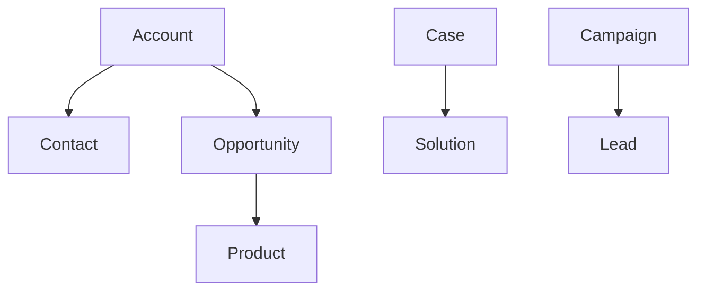

### Custom Object Use Cases:
1. **Inventory Management**:
   - Object: `Product_Inventory__c`
   - Fields: `Warehouse_Location__c`, `Stock_Level__c`
2. **Project Tracking**:
   - Object: `Client_Project__c`
   - Fields: `Start_Date__c`, `Budget__c`, `Status__c`
3. **Event Planning**:
   - Object: `Event_Venue__c`
   - Fields: `Capacity__c`, `Amenities__c`

---

## 3. Fields, Record Types & Page Layouts

### Field Types Deep Dive
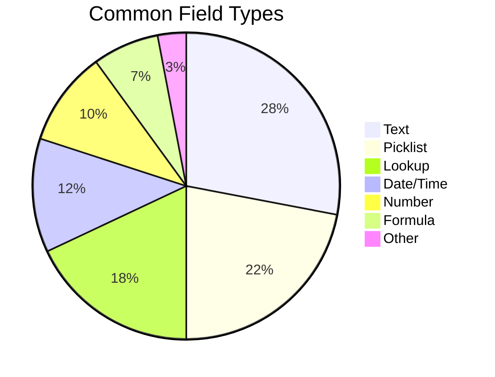

### Record Types & Page Layouts System
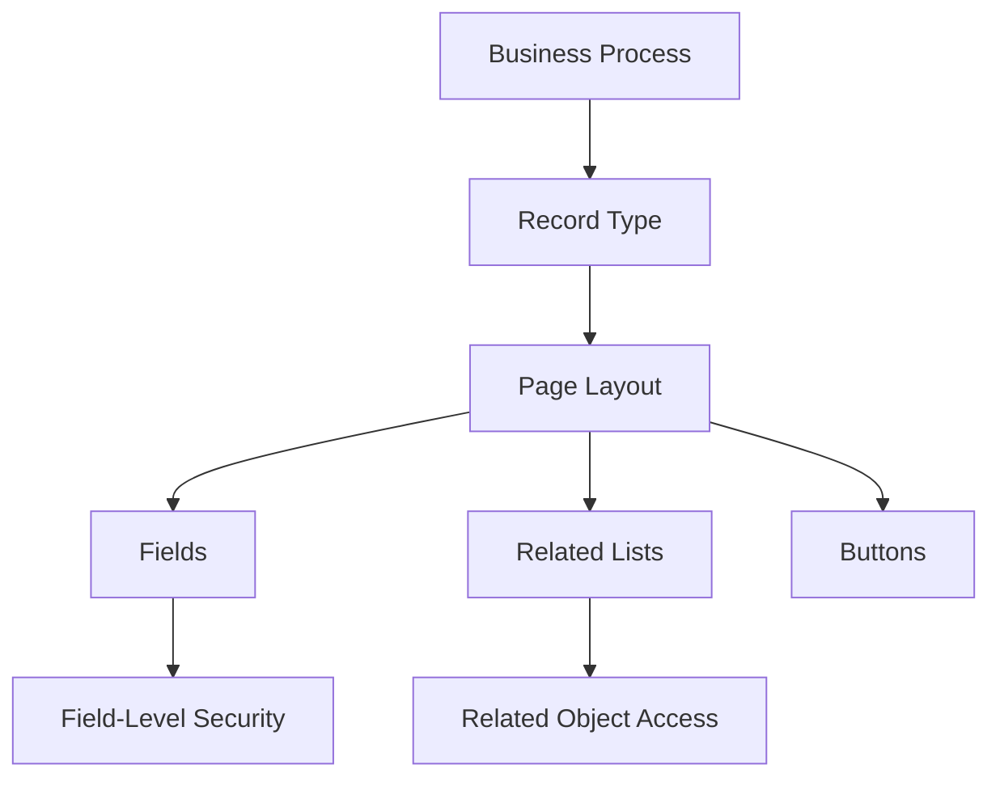

### Key Concepts:
- **Field Properties**:
  - Required vs. optional
  - Unique constraints
  - Default values
  - Help text

- **Record Types**:
  - Different business processes for same object
  - Example: "Commercial" vs "Nonprofit" Accounts
  - Control picklist values per record type

- **Page Layouts**:
  - Organize fields into sections
  - Control visibility per profile
  - Add custom links/buttons
  - Mobile layout configuration

### Best Practices:
1. Use **Field Sets** for flexible page layouts
2. Configure **Compact Layouts** for hover cards
3. Apply **Dynamic Forms** for conditional visibility
4. Use **Validation Rules** for data quality

---

## 4. Relationships (Lookup vs Master-Detail)

### Relationship Comparison
| Feature | Lookup | Master-Detail |
|---------|--------|---------------|
| **Required** | Optional | Mandatory |
| **Deletion** | Restricted or clear | Cascade delete |
| **Sharing** | Separate security | Inherits parent security |
| **Roll-up** | Not possible | Summary fields |
| **Ownership** | Separate | Inherits parent owner |
| **Limit** | 40 per object | 2 per object |

### Relationship Visual Models
**Lookup Relationship**:  
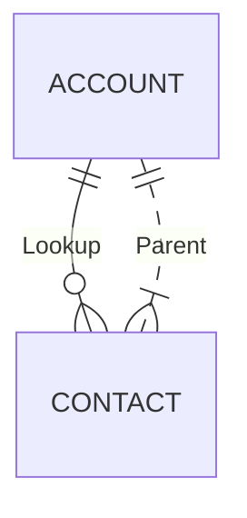

**Master-Detail Relationship**:  
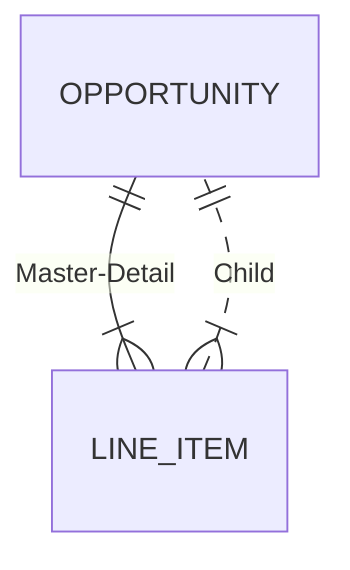

### Special Relationships:
- **Hierarchical Lookup**:
  - User object only
  - Build org charts
  - Example: Manager → Subordinate
  
- **External Lookup**:
  - Connect to external objects
  - Uses OData or custom adapters
  
- **Junction Objects**:
  - Connect two master-detail relationships
  - Enable many-to-many relationships
  - Example: Course__c ← Enrollment__c → Student__c

---

## 5. Creating & Using List Views & Reports

### List Views vs Reports
| Feature | List Views | Reports |
|---------|------------|---------|
| **Scope** | Single object | Multiple objects |
| **Complexity** | Simple filters | Advanced logic |
| **Formatting** | Limited | Charts/groups |
| **Sharing** | User/role-based | Folder-based |
| **Actions** | Mass update | Export only |

### List View Creation Process:
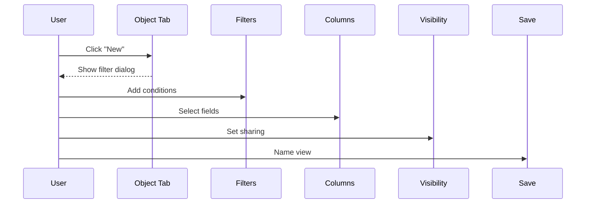

### Report Types & Structures:
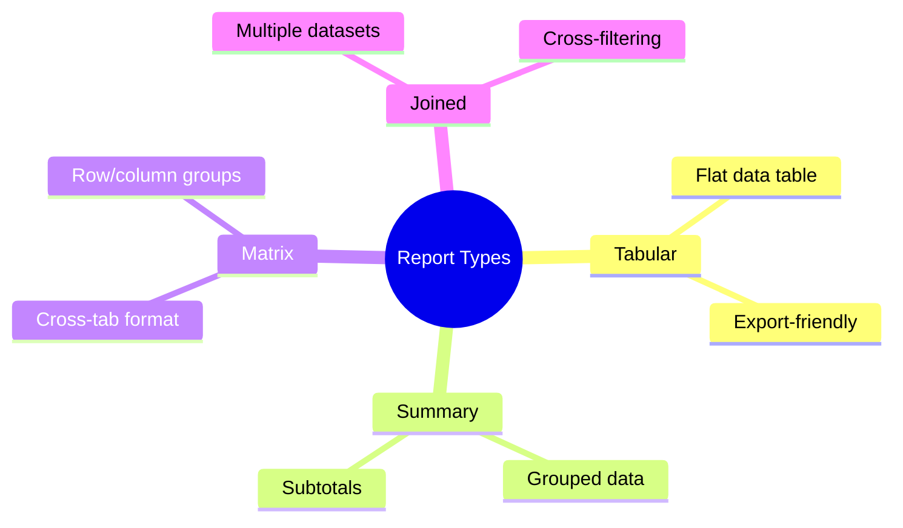

### Report Creation Checklist:
1. Choose report type (e.g., "Accounts with Contacts")
2. Add fields from primary/related objects
3. Apply filters (date ranges, field values)
4. Group data (for summary/matrix reports)
5. Add formulas (e.g., ROI calculation)
6. Set report format (table/chart)
7. Save to folder

---

## 6. Using Dashboards & Report Types

### Dashboard Components
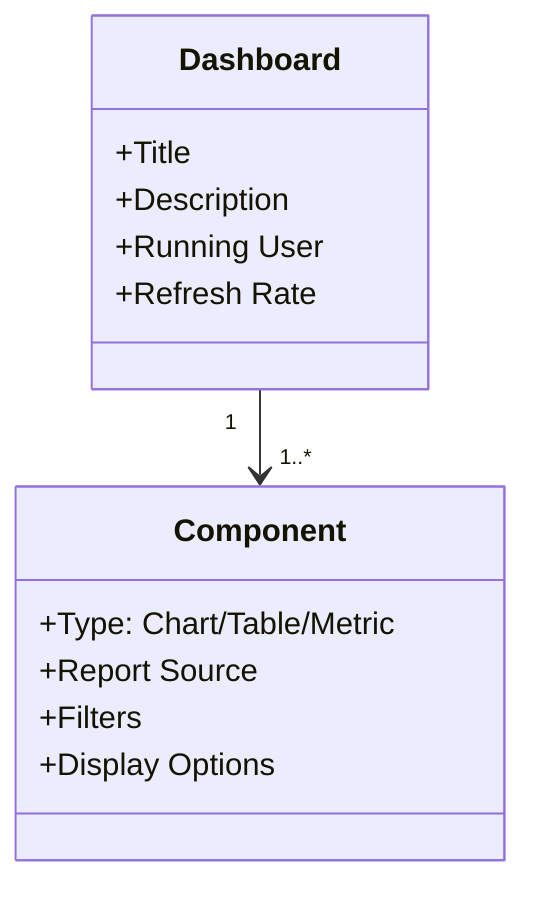

### Dashboard Creation Workflow:
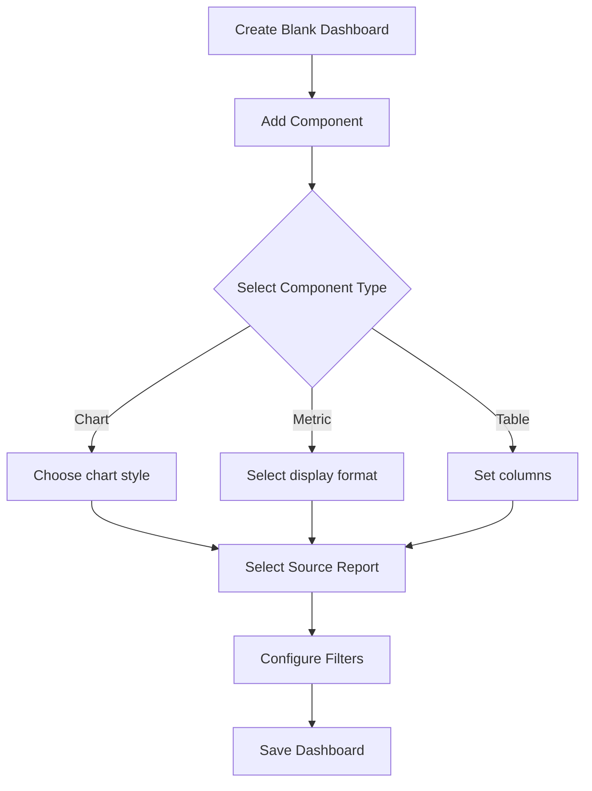

### Report Type Architecture:
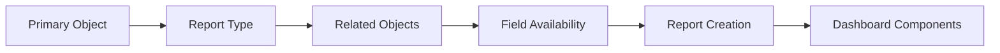

### Dashboard Best Practices:
1. **Component Organization**:
   - Top: Key metrics
   - Middle: Trend charts
   - Bottom: Detailed tables
   
2. **Filter Strategies**:
   - Dynamic date filters (THIS WEEK)
   - Use dashboard filters for global control
   - Component-specific filters when needed

3. **Performance Tips**:
   - Limit components to 15-20
   - Use summary formulas in reports
   - Schedule refreshes during off-hours

---

## Certification Exam Cheat Sheet

### Key Relationships Summary
| Scenario | Recommended Type |
|----------|------------------|
| Optional connection | Lookup |
| Cascade delete needed | Master-Detail |
| Security inheritance | Master-Detail |
| Roll-up calculations | Master-Detail |
| Org chart structure | Hierarchical Lookup |

### Report Type Selection Guide
| Business Need | Report Type |
|---------------|-------------|
| Simple data export | Tabular |
| Grouped data with totals | Summary |
| Comparison by category | Matrix |
| Data from multiple objects | Joined |

### Navigation Quick Reference
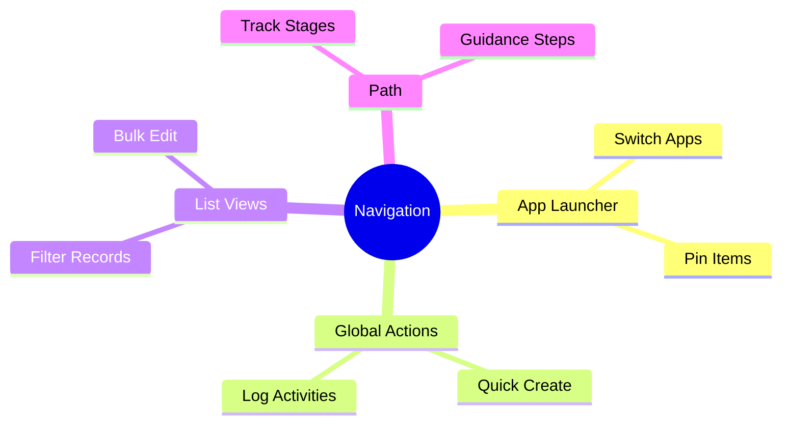

### Exam Preparation Tips:
1. **Hands-on Practice**: Use Trailhead Playground
2. **Focus Areas**:
   - Master-detail vs lookup scenarios
   - Page layout assignment rules
   - Report folder sharing
   - Dashboard running user
3. **Common Pitfalls**:
   - Custom objects require __c suffix
   - Master-detail limits (2 per object)
   - Joined reports require same data type
4. **Memory Aids**:
   - "Master-Detail = Mandatory & Cascade"
   - "Lookup = Loose connection"
   - "Summary = Subtotals"
