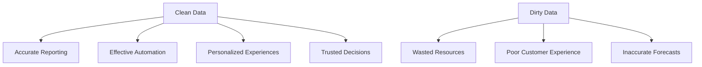
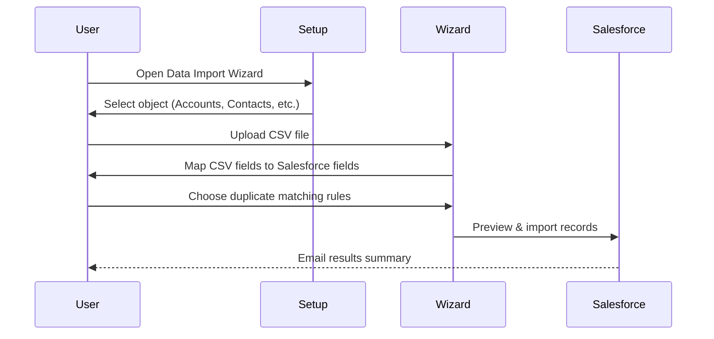
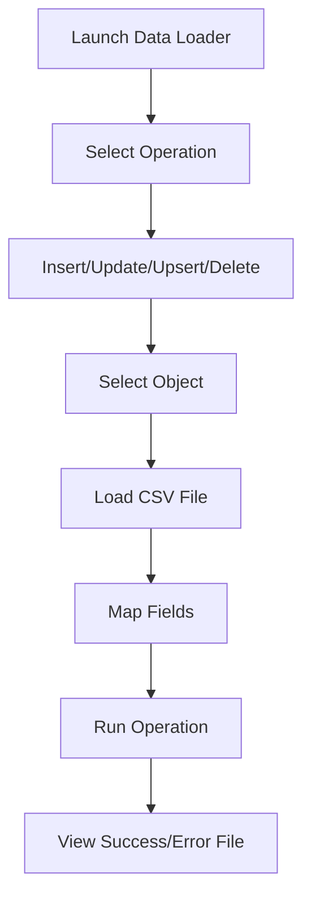
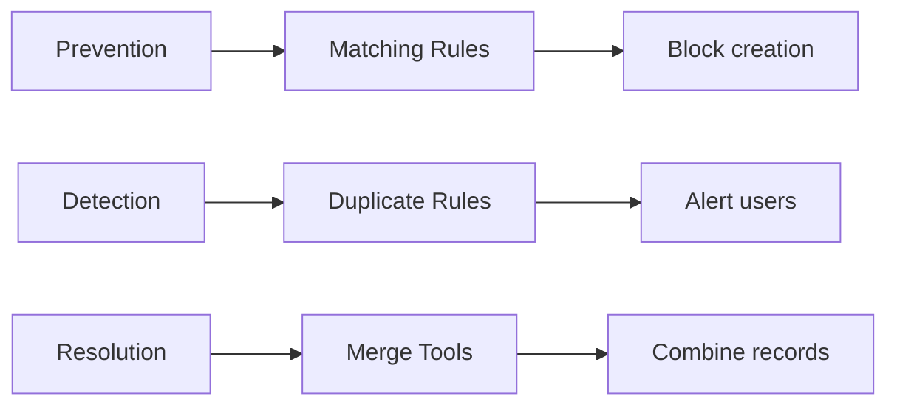
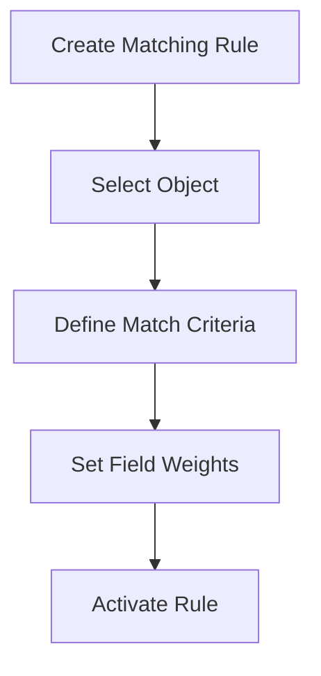
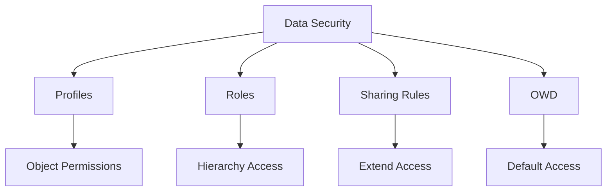
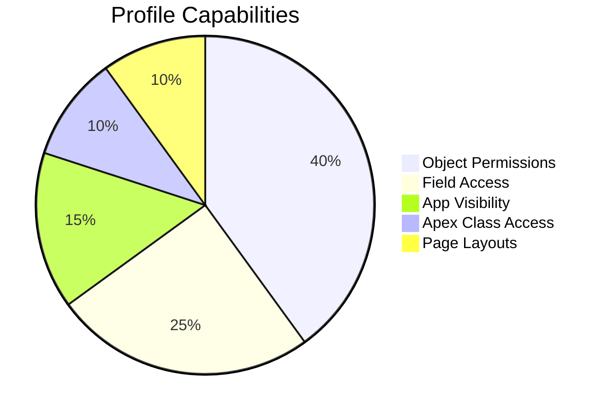
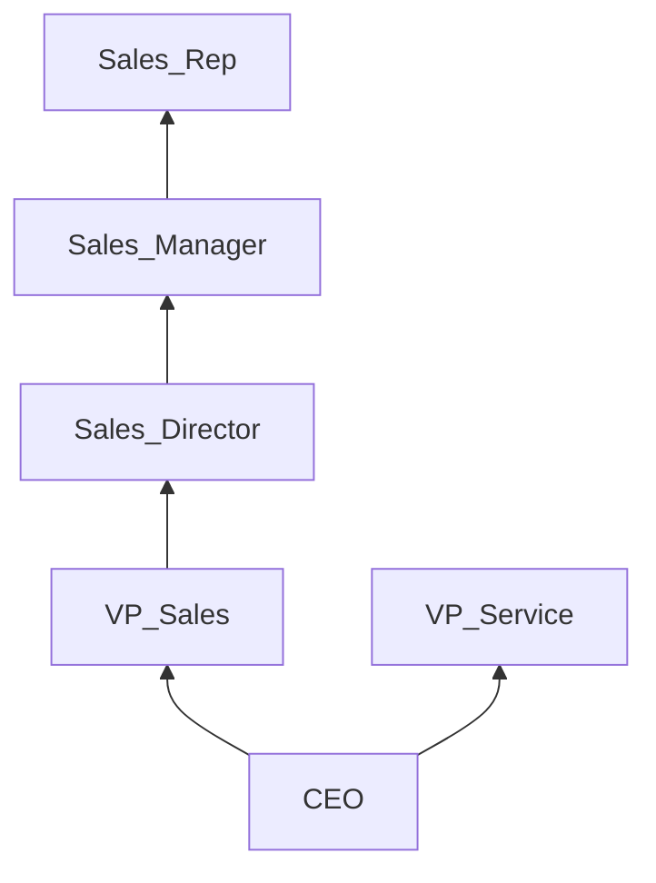
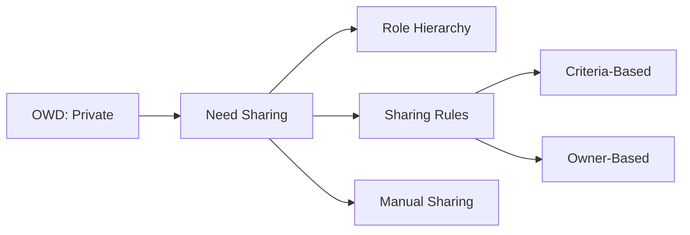
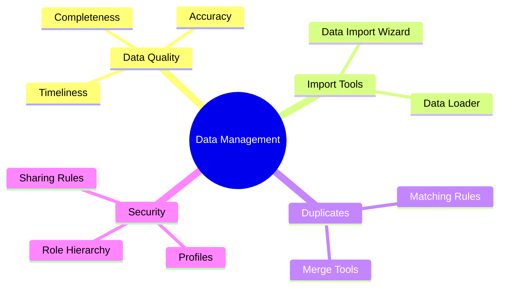

## 1. Importance of Data Hygiene & Data Quality

### Why Data Quality Matters

### Data Hygiene Framework
| **Component** | **Impact** | **Example** |
|---------------|------------|-------------|
| **Completeness** | 95% complete data → 30% higher conversion | Require Industry field on Accounts |
| **Accuracy** | Clean data → 20% less service time | Validate email formats automatically |
| **Consistency** | Standard values → 40% faster reporting | Use picklists instead of free text |
| **Timeliness** | Daily updates → 15% better forecasting | Auto-update Last Activity Date |
| **Uniqueness** | No duplicates → 25% cost savings | Merge duplicate Accounts |

### Data Quality Best Practices:
1. **Validation Rules**:
   - Enforce data formats (e.g., phone numbers)
   - Example: `REGEX(Phone, "\\d{3}-\\d{3}-\\d{4}")`
   
2. **Required Fields**:
   - Critical fields should be mandatory
   - Example: Opportunity Amount must be > 0

3. **Automated Cleansing**:
   - Use tools like Salesforce Data.com
   - Schedule weekly data health checks

4. **Data Audits**:
   - Run monthly "Dirty Data" reports
   - Assign cleanup tasks to owners

---

## 2. Import/Export Tools: Data Import Wizard vs Data Loader

### Tool Comparison Matrix
| **Feature** | **Data Import Wizard** | **Data Loader** |
|-------------|------------------------|-----------------|
| **Interface** | Web-based | Desktop application |
| **Max Records** | 50,000 | 5 million+ |
| **Objects** | Standard + custom objects | All objects + metadata |
| **Use Case** | Simple imports | Complex data operations |
| **Automation** | Manual | Scriptable |
| **File Format** | CSV only | CSV, XML, JSON |

### Data Import Wizard Workflow:

### Data Loader Process:

### Key Operations:
- **Insert**: Add new records
- **Update**: Modify existing records
- **Upsert**: Update or insert using external ID
- **Delete**: Remove records permanently
- **Export**: Extract data for backup

### Best Practices:
1. Always **backup data** before imports
2. Use **external IDs** for upsert operations
3. **Test** with small batches first
4. Schedule **off-peak hours** for large loads
5. Utilize **bulk API** for >10,000 records

---

## 3. Managing Duplicate Records

### Duplicate Management Framework

### Matching Rule Configuration:

### Duplicate Management Process:
1. **Define Matching Rules**:
   - Criteria: Same email domain + similar company name
   - Weight: Email=80%, Company Name=20%

2. **Configure Duplicate Rules**:
   - Action: Block creation or show alert
   - Scope: Apply to specific profiles

3. **Merge Duplicates**:
   - Select 3 master records maximum
   - Choose winning record
   - Merge related records (Contacts, Opportunities)

### Merge Example:
**Duplicate Accounts**:
| Field | TechSoft Inc | TechSoft LLC | Merged Result |
|-------|--------------|--------------|---------------|
| **Name** | TechSoft Inc | TechSoft LLC | TechSoft Inc |
| **Phone** | (555) 123-4567 | (555) 987-6543 | (555) 123-4567 |
| **Website** | techsoft.com | techsoft-llc.com | techsoft.com |
| **Employees** | 50 | 75 | 75 |

### Best Practices:
- Standardize **naming conventions** (e.g., "Inc" vs "LLC")
- Use **fuzzy matching** for slight variations
- **Combine** notes and activities when merging
- Regularly run **"Find Duplicates"** reports

---

## 4. Data Security: Profiles, Roles & Sharing

### Security Model Overview

### Core Components:

#### 1. **Profiles**

#### 2. **Role Hierarchy**

#### 3. **Sharing Model**

### Security Configuration:

#### Object-Level Security (Profiles)
| **Permission** | **Impact** |
|----------------|------------|
| **Read** | View records |
| **Create** | Add new records |
| **Edit** | Modify existing records |
| **Delete** | Remove records |
| **View All** | Bypass sharing rules |
| **Modify All** | Full object control |

#### Sharing Tools Comparison
| **Method** | **Best For** | **Limitations** |
|------------|--------------|-----------------|
| **Role Hierarchy** | Reporting structures | Vertical access only |
| **Sharing Rules** | Team-based access | Can't restrict access |
| **Manual Sharing** | One-off exceptions | Not scalable |
| **Apex Managed Sharing** | Complex logic | Requires coding |

### Security Best Practices:
1. Follow **principle of least privilege**
2. Set OWD to **Private** for sensitive objects
3. Use **criteria-based sharing** for dynamic access
4. **Audit permissions** quarterly
5. Utilize **permission sets** for granular access

---

## Certification Exam Cheat Sheet

### Data Management Summary

### Key Exam Concepts:
1. **Data Import Wizard Limitations**:
   - Max 50,000 records
   - Only standard/custom objects
   - CSV format only

2. **Duplicate Rule Actions**:
   - Block: Prevent record save
   - Allow: Save with warning
   - Report: Log duplicate

3. **Profile vs Permission Set**:
   - Profiles: Baseline permissions
   - Permission Sets: Additional privileges

4. **OWD Settings**:
   - Private: Most restrictive
   - Public Read Only
   - Public Read/Write

### Exam Scenario Solutions:
| **Scenario** | **Solution** |
|--------------|--------------|
| Migrate 100,000 leads | Data Loader with bulk API |
| Prevent duplicate contacts | Matching rule + duplicate rule |
| Give temporary access to record | Manual sharing |
| Export data for compliance | Data Loader export |
| Cleanse outdated accounts | Scheduled "Last Activity" report |

**Hands-on Practice Recommendations**:  
1. Trailhead: "Data Management" module  
2. Import 50 contacts using Data Import Wizard  
3. Create a matching rule for Accounts  
4. Configure profile for sales reps  
5. Export data using Data Loader