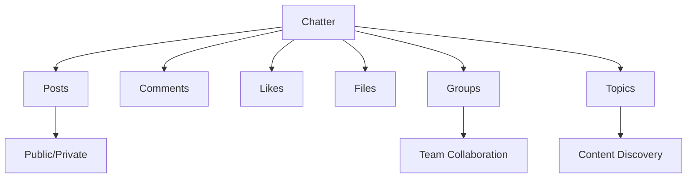
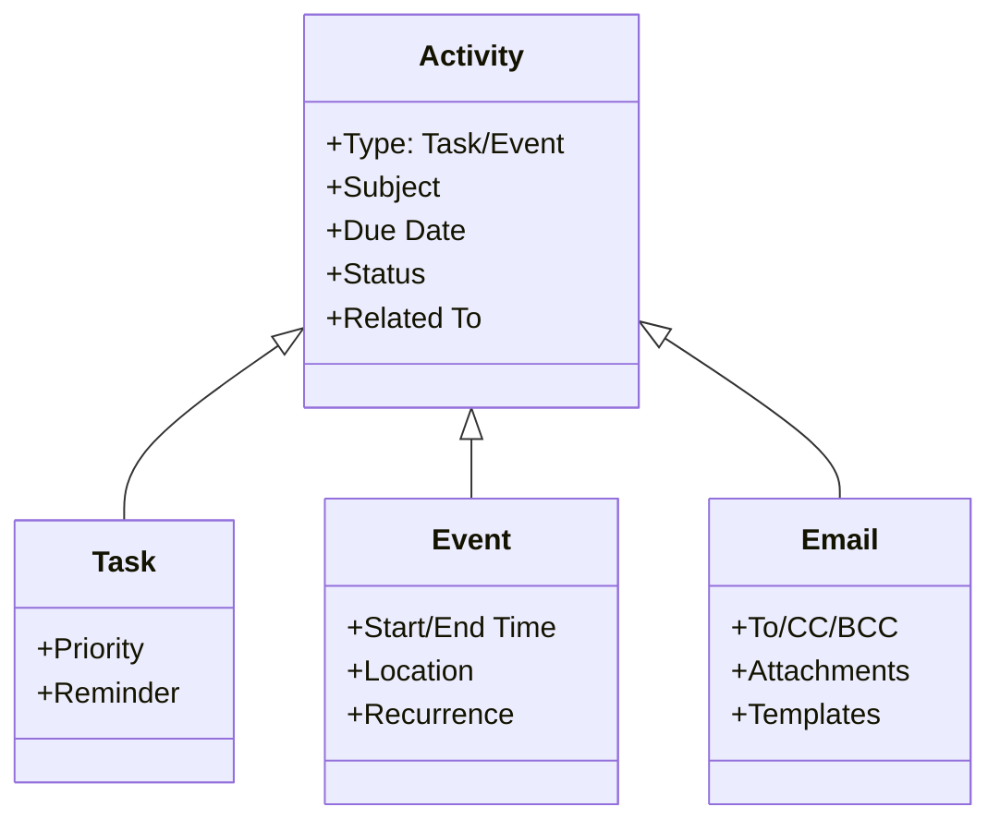
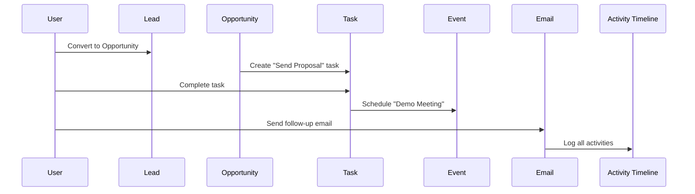
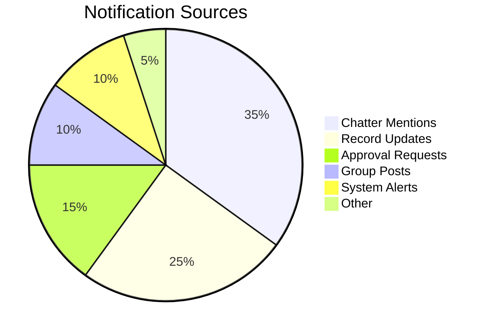
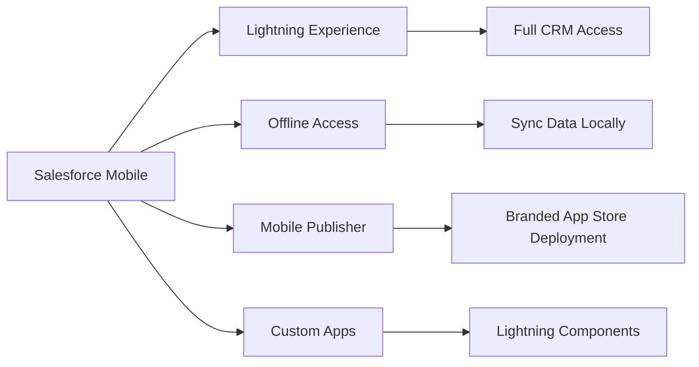
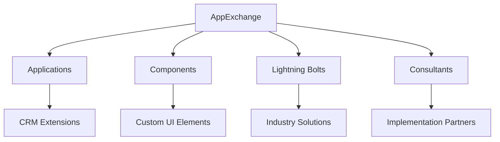
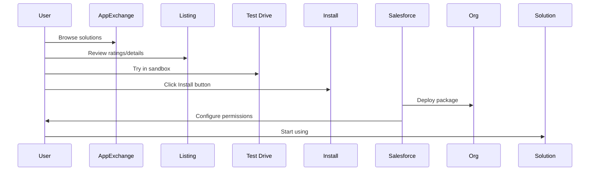
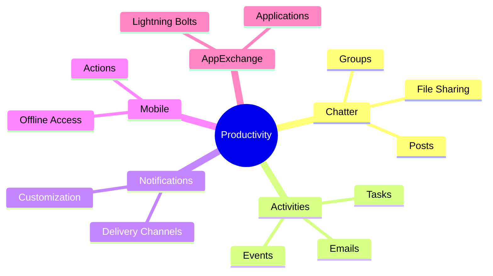

## 1. Salesforce Chatter for Communication

### Chatter Ecosystem Overview


### Key Features & Capabilities:
- **Feed-Based Communication**:
  - Post updates to profiles, records, or groups
  - Mention users with `@username` notifications
  - Example: `@SarahJohnson Please review this Opportunity update`

- **Collaboration Tools**:
  - **Groups**: 
    - Public (anyone can join)
    - Private (invitation only)
    - Unlisted (secret groups)
  - **Topics**: 
    - Tag posts for discovery (#DataMigration)
    - Follow topics for updates

- **File Sharing**:
  - Attach files directly to feeds
  - Collaborative editing (Google Docs integration)
  - Version control for documents

- **Record Collaboration**:
  - Follow records for updates
  - Discuss opportunities/cases in context
  - Example: Sales team discussing deal strategy on Opportunity record

### Chatter Best Practices:
1. Use **#hashtags** for project tracking
2. **@mention** key stakeholders for alerts
3. Create **private groups** for sensitive projects
4. **Follow** critical records and topics
5. Use **polls** for quick team decisions

---

## 2. Activities: Tasks, Events & Emails

### Activity Management System


### Key Components:

#### Tasks
- **Purpose**: Track to-do items
- **Fields**: 
  - Subject (e.g., "Follow up with ACME Corp")
  - Due Date
  - Priority (High/Medium/Low)
  - Status (Not Started/In Progress/Completed)
- **Example**: Create task from Lead record with reminder

#### Events
- **Purpose**: Schedule meetings
- **Features**:
  - Calendar integration
  - Recurrence (daily/weekly/monthly)
  - Resource scheduling (rooms, equipment)
- **Example**: Quarterly review meeting with customer

#### Emails
- **Purpose**: Track communications
- **Capabilities**:
  - Send from Salesforce (via Outlook/Gmail integration)
  - Templates for standardized messages
  - Log emails to related records automatically
- **Example**: Send proposal email template to Opportunity contact

### Activity Management Workflow:


---

## 3. Managing Notifications

### Notification Framework


### Configuration Options:
1. **Delivery Channels**:
   - In-app notifications (bell icon)
   - Mobile push notifications
   - Email digests
   - Desktop alerts

2. **Customization Settings**:
   ```mermaid
   flowchart LR
       A[Notification Settings] --> B[Per Object]
       A --> C[Per Action Type]
       A --> D[Per Channel]
       B --> E[Leads, Cases, Opportunities]
       C --> F[Posts, Comments, Mentions]
       D --> G[Email, Mobile, Desktop]
   ```

3. **Subscription Models**:
   - Follow records/users/groups
   - Set notification frequency (immediately/daily digest)
   - Mute specific conversations

### Best Practices:
- Set **high-priority alerts** for:
  - Approval requests
  - Critical case updates
  - @mentions
- Use **daily digests** for:
  - Group updates
  - Record followers
- **Mute notifications** during vacations
- Create **custom notification types** for business processes

---

## 4. Mobile Access & Features

### Salesforce Mobile Architecture


### Key Mobile Features:
| **Feature** | **Description** | **Business Impact** |
|-------------|-----------------|---------------------|
| **Mobile App** | Full-featured iOS/Android app | Access CRM anywhere |
| **Offline Mode** | Work without internet | Field productivity increase 30% |
| **Mobile Actions** | Quick record creation | Reduce data entry time by 50% |
| **Location Services** | Map views & directions | Optimize field routes |
| **Camera Integration** | Scan business cards | Auto-create contacts |
| **Mobile Publisher** | Custom branded apps | Deploy partner/employee apps |

### Mobile Use Cases:
1. **Sales Reps**:
   - Update opportunities onsite
   - Access customer history during visits
   - Capture signatures with device camera

2. **Service Technicians**:
   - View assigned cases offline
   - Access knowledge articles
   - Capture equipment photos

3. **Executives**:
   - Approve requests on-the-go
   - Monitor dashboards
   - Join meetings via mobile

---

## 5. AppExchange Overview

### AppExchange Ecosystem


### Key Statistics:
- 7,000+ solutions
- 10M+ installs
- 90% of Fortune 100 companies use AppExchange
- 4.5/5 average rating

### Solution Categories:
| **Category** | **Examples** | **Business Need** |
|--------------|--------------|-------------------|
| **Sales & CRM** | DocuSign, ZoomInfo | Enhance sales processes |
| **Service & Support** | ServiceMax, SurveyMonkey | Improve customer service |
| **Marketing** | Mailchimp, Pardot | Campaign management |
| **IT & Admin** | OwnBackup, Copado | Data management |
| **Industry Solutions** | Veeva (Life Sciences) | Vertical-specific needs |

### AppExchange Implementation Process:


### Best Practices:
1. **Evaluate Before Installing**:
   - Check security reviews
   - Review support SLAs
   - Test in sandbox first
   
2. **Post-Installation**:
   - Configure permission sets
   - Train users
   - Monitor performance

3. **Maintenance**:
   - Keep apps updated
   - Review usage reports
   - Have exit strategy for unused apps

---

## Certification Exam Cheat Sheet

### Productivity Framework


### Key Exam Concepts:
1. **Chatter Visibility**:
   - Public posts = visible to org
   - Private groups = members only
   - Record feeds = visible to record access holders

2. **Activity Relationships**:
   - Tasks = Single due date
   - Events = Start/end time
   - Both link to records

3. **Notification Hierarchy**:
   - User settings > Org defaults
   - Mobile > Email > In-app priority

4. **Mobile Offline Limits**:
   - 10,000 records max
   - 30 days sync window
   - 100MB cache limit

5. **AppExchange Security**:
   - Security review required
   - Permission sets control access
   - Managed vs unmanaged packages

### Exam Scenario Solutions:
| **Scenario** | **Solution** |
|--------------|--------------|
| Collaborate on sales proposal | Chatter file sharing in Opportunity group |
| Schedule recurring customer check-in | Recurring event with email template |
| Reduce notification overload | Customize digest settings |
| Enable field work without internet | Configure mobile offline access |
| Find CPQ solution | Browse AppExchange financial apps |

**Recommended Trailhead Modules**:  
- "Collaborate with Chatter"  
- "Salesforce Mobile App"  
- "AppExchange Basics"  
- "Productivity Tools"