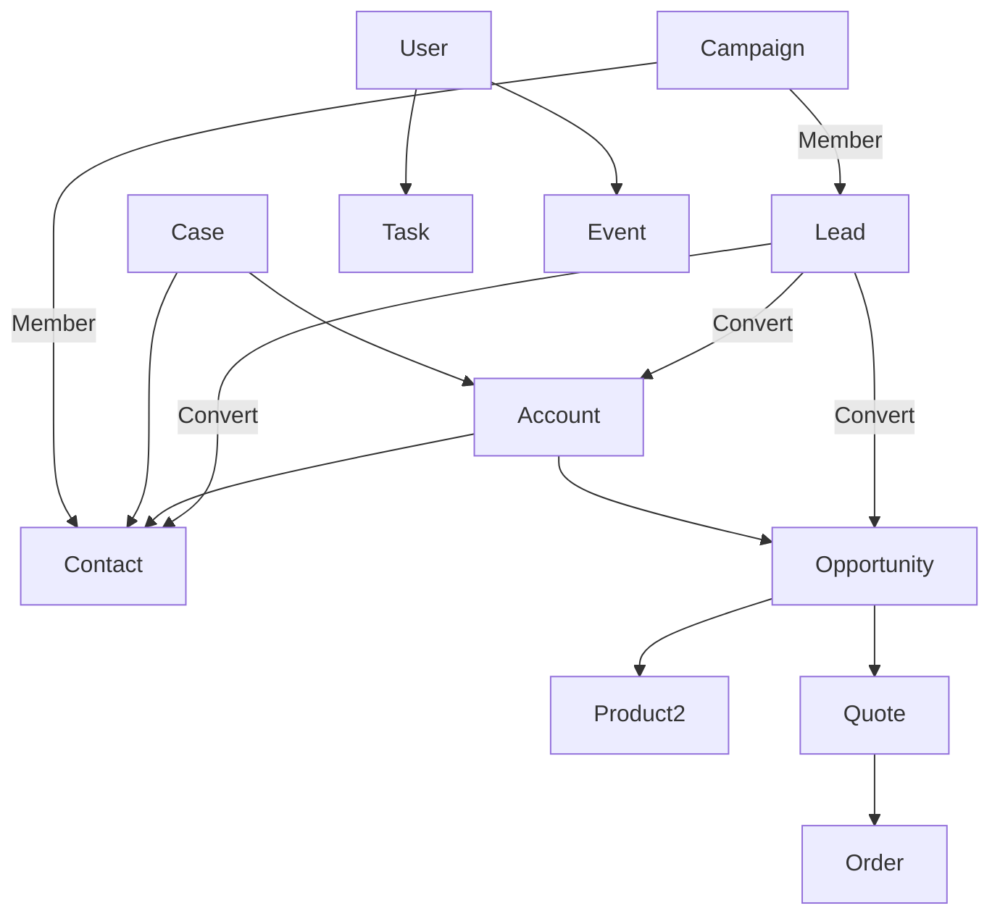

## 🔹 What is an Object?

In Salesforce, an **object** is a table that stores data. Each row is a record, and each column is a field.

---

## 🧱 1. Standard Core Objects

|Object API Name|Label|Purpose|
|---|---|---|
|`Account`|Account|Represents a company or organization (B2B) or an individual (B2C).|
|`Contact`|Contact|Individuals associated with an Account.|
|`Opportunity`|Opportunity|Potential revenue-generating sales deals.|
|`Lead`|Lead|Unqualified prospects; can be converted to Account, Contact, and Opportunity.|
|`Case`|Case|Customer inquiries, issues, or complaints.|
|`Task`|Task|To-do items or follow-ups linked to any object.|
|`Event`|Event|Calendar-based interactions, such as meetings or calls.|
|`User`|User|Represents a Salesforce user. Controls access and login info.|
|`Campaign`|Campaign|Marketing initiatives for leads or opportunities.|
|`Asset`|Asset|Products purchased by customers.|
|`Product2`|Product|Items sold in opportunities.|
|`Pricebook2`|Price Book|List of products and their prices.|
|`Quote`|Quote|Record of proposed prices for products/services.|
|`Order`|Order|Confirmed request for products/services.|
|`Contract`|Contract|Legal agreements with customers.|
|`Solution`|Solution|Legacy knowledgebase content (replaced by Knowledge).|

---

## 🧾 2. Administrative & Platform Objects

|Object API Name|Label|Purpose|
|---|---|---|
|`Group`|Public Group|Collections of users for sharing rules.|
|`QueueSobject`|Queue|Handles object-level record assignment.|
|`PermissionSet`|Permission Set|Extra permissions for specific users.|
|`Profile`|Profile|Base-level user permissions.|
|`RecordType`|Record Type|Enables different page layouts and picklist values.|
|`FieldPermissions`, `ObjectPermissions`|Field/Object Permission|Used to control access.|
|`LoginHistory`|Login History|User login records.|
|`ApexClass`, `ApexTrigger`|Apex Code|Metadata for code customization.|
|`Flow`|Flow|Stores flows for process automation.|

---

## 📊 3. Sales Cloud Objects

|Object API Name|Label|Purpose|
|---|---|---|
|`Lead`, `Opportunity`, `Contact`, `Account`|Core Sales Objects|Track B2B/B2C lifecycle.|
|`CampaignMember`|Campaign Member|Join object between Lead/Contact and Campaign.|
|`ForecastingItem`|Forecast|Sales forecasting data.|
|`OpportunityLineItem`|Opportunity Product|Products attached to an opportunity.|
|`Territory2`, `Territory2Model`|Territory|Sales territory management.|

---

## 💬 4. Service Cloud Objects

|Object API Name|Label|Purpose|
|---|---|---|
|`Case`|Case|Track and manage customer issues.|
|`ServiceContract`|Service Contract|Defines support coverage.|
|`Entitlement`, `Milestone`|Entitlement|SLA commitments.|
|`Knowledge__kav`|Knowledge|Knowledge base articles.|
|`LiveChatTranscript`|Live Chat|Store live agent transcripts.|
|`AgentWork`, `WorkItem`|Omni-Channel|Tracks workload and routing.|

---

## 📈 5. Marketing Cloud & Pardot Objects

|Object API Name|Label|Purpose|
|---|---|---|
|`Campaign`|Campaign|Used for email, digital, and offline campaigns.|
|`EmailMessage`|Email Message|Email logs in Service Cloud.|
|`EngagementHistory`|Pardot Engagement|Tracks Pardot prospect activity.|

---

## 🏭 6. Industry-Specific Objects (Common in Vlocity, FSC, etc.)

|Industry|Common Objects|
|---|---|
|Financial Services Cloud|`Household`, `FinancialAccount`, `Goal`, `FinancialHolding`|
|Health Cloud|`CarePlan`, `ClinicalNote`, `Patient`|
|Education Cloud|`Affiliation`, `CourseOffering`, `ProgramEnrollment`|
|Manufacturing Cloud|`AccountForecast`, `ProductForecast`|

---

## 🧩 7. Custom Metadata & Settings

|Type|Example|Purpose|
|---|---|---|
|Custom Metadata|`MyApp_Settings__mdt`|Stores metadata records, deployable via package.|
|Custom Setting (Hierarchy)|`DiscountRate__c`|Stores configuration data scoped to org/profile/user.|

---

## 🔗 8. Object Relationship Diagram

---

## 🛠 9. Other Notable Objects

|Object API Name|Label|Purpose|
|---|---|---|
|`Attachment`|Attachment|Stores binary file data (legacy, use `ContentDocument` now).|
|`ContentVersion`, `ContentDocument`|File|Replaces Attachments. Modern file system.|
|`FeedItem`|Chatter Feed|Stores feed content for collaboration.|
|`CustomObject__c`|Custom Object|User-defined tables for tailored use cases.|

---

## 📦 10. Package & Deployment-Related Objects

|Object API Name|Label|Purpose|
|---|---|---|
|`InstalledPackage`|Package|Info about managed/unmanaged packages.|
|`PackageLicense`|License|Licenses for installed packages.|
|`Deployment`|Deployment|Metadata deployment tracking.|

---

## ✅ 11. Common Join and Junction Objects

|Object API Name|Label|Purpose|
|---|---|---|
|`CampaignMember`|Campaign Member|Join object between Lead/Contact and Campaign.|
|`OpportunityContactRole`|Contact Role|Relationship between Opportunity and Contact.|
|`AccountContactRelation`|Contact to Multiple Accounts|Maintains many-to-many Account-Contact relationship.|

---

## 🧠 12. Summary

Salesforce objects fall into several categories:

- **Core CRM**: Accounts, Contacts, Leads, Opportunities
    
- **Automation & Administration**: Users, Profiles, RecordTypes
    
- **Industry Cloud**: Specialized objects per sector
    
- **Custom**: Fully user-defined for specific processes
    

> 🔍 Understanding these objects is critical for Admins, Developers, and Architects to build efficient, scalable Salesforce apps.

---
