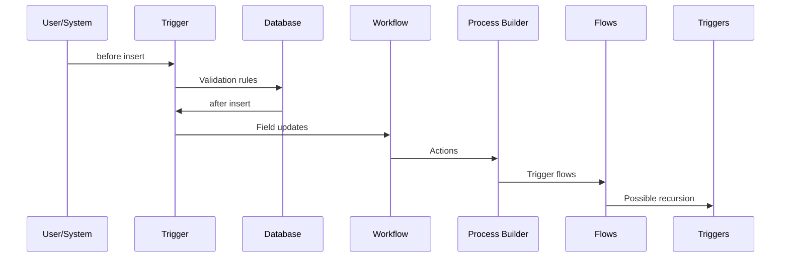
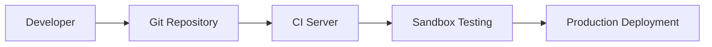

## 1. Introduction to Apex Triggers <a name="introduction"></a>
**Apex Triggers** are pieces of Apex code that execute:
- Before or after specific data manipulation events
- When records are inserted, updated, deleted, or undeleted
- To enforce complex business rules beyond validation rules
- To modify related records automatically

### Key Characteristics:
- **Event-Driven**: Respond to DML operations
- **Object-Specific**: Each trigger is associated with a Salesforce object
- **Context-Aware**: Access special context variables
- **Bulk-Enabled**: Must handle multiple records simultaneously

### When to Use Triggers:
- Automatically update related records
- Enforce complex validation rules
- Create audit records for changes
- Integrate with external systems
- Implement complex business logic

### Trigger vs. Other Automation Tools:
| Tool               | Best For                          | Limitations                  |
|--------------------|-----------------------------------|------------------------------|
| **Apex Triggers**  | Complex logic, cross-object updates | Requires coding skills      |
| **Validation Rules**| Field-level validation            | Simple logic only           |
| **Workflow Rules** | Field updates, email alerts       | No cross-object updates     |
| **Process Builder**| Multi-step automation             | Performance with large data |

---

## 2. Trigger Syntax and Structure <a name="syntax"></a>
### Basic Trigger Structure:
```apex
trigger TriggerName on ObjectName (trigger_events) {
    // Trigger logic
}
```

### Key Components:
- **Trigger Name**: Unique identifier (e.g., `AccountTrigger`)
- **Object Name**: Salesforce object (e.g., `Account`, `Contact`)
- **Trigger Events**: Comma-separated events (e.g., `before insert, after update`)

### Example Trigger:
```apex
trigger OpportunityTrigger on Opportunity (before update) {
    for(Opportunity opp : Trigger.new) {
        if(opp.StageName == 'Closed Won') {
            opp.Description = 'Won opportunity!';
        }
    }
}
```

### Trigger File Structure:
```
classes/
├── OpportunityTriggerHandler.cls
triggers/
├── OpportunityTrigger.trigger
```

---

## 3. Trigger Context Variables <a name="context"></a>
### Essential Context Variables:
| Variable             | Description                                                                 | Available In                 |
|----------------------|-----------------------------------------------------------------------------|------------------------------|
| `Trigger.isBefore`   | True for before triggers (before saving)                                    | All events                   |
| `Trigger.isAfter`    | True for after triggers (after saving)                                      | All events                   |
| `Trigger.new`        | List of new record versions                                                 | insert, update, undelete     |
| `Trigger.old`        | List of old record versions                                                 | update, delete               |
| `Trigger.newMap`     | Map of ID to new record versions                                            | update, insert, undelete     |
| `Trigger.oldMap`     | Map of ID to old record versions                                            | update, delete               |
| `Trigger.size`       | Total records in trigger invocation                                         | All events                   |
| `Trigger.isInsert`   | True for insert operation                                                   | insert                       |
| `Trigger.isUpdate`   | True for update operation                                                   | update                       |
| `Trigger.isDelete`   | True for delete operation                                                   | delete                       |
| `Trigger.isUndelete` | True for undelete operation                                                 | undelete                     |

### Usage Example:
```apex
trigger ContactTrigger on Contact (before update) {
    for(Contact con : Trigger.new) {
        // Get previous value from oldMap
        Contact oldCon = Trigger.oldMap.get(con.Id);
        
        if(con.Email != oldCon.Email) {
            con.Email_Changed__c = true;
        }
    }
}
```

---

## 4. Trigger Events and Execution Order <a name="events"></a>
### Trigger Events:
| Event            | Description                                                                 | Common Use Cases                     |
|------------------|-----------------------------------------------------------------------------|--------------------------------------|
| `before insert`  | Before records are inserted to database                                     | Set default values, validation       |
| `after insert`   | After records are inserted to database                                      | Create related records, callouts     |
| `before update`  | Before existing records are updated                                         | Validation, auto-calculations       |
| `after update`   | After existing records are updated                                          | Update related records, sync data   |
| `before delete`  | Before records are deleted                                                  | Prevent deletion, archive data      |
| `after delete`   | After records are deleted                                                   | Update rollups, cleanup tasks       |
| `after undelete` | After records are recovered from Recycle Bin                                | Restore relationships, audit trails |

### Execution Order:


---

## 5. Bulk Trigger Design Patterns <a name="bulk-patterns"></a>
### Why Bulkification Matters:
- Triggers process up to 200 records in a single transaction
- Non-bulkified code hits governor limits
- Essential for performance and scalability

### Bulkification Techniques:
1. **Avoid SOQL/DML in Loops**:
   ```apex
   // BAD: SOQL inside loop
   for(Account acc : Trigger.new) {
       List<Contact> contacts = [SELECT Id FROM Contact WHERE AccountId = :acc.Id];
   }
   
   // GOOD: Bulk SOQL
   Set<Id> accountIds = new Set<Id>();
   for(Account acc : Trigger.new) {
       accountIds.add(acc.Id);
   }
   Map<Id, List<Contact>> accountContacts = new Map<Id, List<Contact>>();
   for(Contact con : [SELECT Id, AccountId FROM Contact WHERE AccountId IN :accountIds]) {
       if(!accountContacts.containsKey(con.AccountId)) {
           accountContacts.put(con.AccountId, new List<Contact>());
       }
       accountContacts.get(con.AccountId).add(con);
   }
   ```

2. **Use Collections Efficiently**:
   ```apex
   List<Opportunity> oppsToUpdate = new List<Opportunity>();
   for(Opportunity opp : Trigger.new) {
       if(opp.Amount > 10000) {
           opp.Priority__c = 'High';
           oppsToUpdate.add(opp);
       }
   }
   // Single DML outside loop
   update oppsToUpdate;
   ```

3. **Handle Mixed DML Operations**:
   ```apex
   List<User> usersToUpdate = new List<User>();
   List<Contact> contactsToUpdate = new List<Contact>();
   
   for(Contact con : Trigger.new) {
       contactsToUpdate.add(con);
       if(con.Owner.IsActive) {
           usersToUpdate.add(con.Owner);
       }
   }
   
   update contactsToUpdate;
   update usersToUpdate;
   ```

---

## 6. Trigger Handler Framework <a name="handler-framework"></a>
### Why Use a Handler Class?
- Separates business logic from trigger mechanics
- Improves code maintainability
- Prevents recursion
- Enables better testing

### Basic Handler Pattern:
```apex
// Trigger
trigger AccountTrigger on Account (before insert, after insert, before update) {
    AccountTriggerHandler handler = new AccountTriggerHandler();
    
    if(Trigger.isBefore) {
        if(Trigger.isInsert) handler.beforeInsert(Trigger.new);
        if(Trigger.isUpdate) handler.beforeUpdate(Trigger.new, Trigger.oldMap);
    }
    if(Trigger.isAfter && Trigger.isInsert) {
        handler.afterInsert(Trigger.new);
    }
}
```

### Handler Class Structure:
```apex
public class AccountTriggerHandler {
    // Context-specific methods
    public void beforeInsert(List<Account> newAccounts) {
        // Logic for before insert
    }
    
    public void beforeUpdate(List<Account> newAccounts, Map<Id, Account> oldMap) {
        // Logic for before update
    }
    
    public void afterInsert(List<Account> newAccounts) {
        // Logic for after insert
    }
    
    // Recursion prevention
    private static Boolean run = true;
    public static Boolean shouldRun() {
        if(run) {
            run = false;
            return true;
        }
        return false;
    }
}
```

### Advanced Framework Features:
- **Inheritance**: Base trigger handler class
- **Interface-based**: Implement trigger handler interface
- **Metadata-driven**: Custom metadata to enable/disable triggers
- **Logging**: Automatic error logging

---

## 7. Common Trigger Scenarios <a name="common-scenarios"></a>
### 1. Auto-Creating Related Records:
```apex
public void afterInsert(List<Account> newAccounts) {
    List<Contact> contactsToCreate = new List<Contact>();
    
    for(Account acc : newAccounts) {
        contactsToCreate.add(new Contact(
            FirstName = 'Account',
            LastName = 'Manager',
            AccountId = acc.Id
        ));
    }
    
    insert contactsToCreate;
}
```

### 2. Field History Tracking:
```apex
public void afterUpdate(List<Opportunity> newOpps, Map<Id, Opportunity> oldMap) {
    List<Opportunity_History__c> historyRecords = new List<Opportunity_History__c>();
    
    for(Opportunity opp : newOpps) {
        Opportunity oldOpp = oldMap.get(opp.Id);
        
        if(opp.Amount != oldOpp.Amount) {
            historyRecords.add(new Opportunity_History__c(
                Opportunity__c = opp.Id,
                Field__c = 'Amount',
                Old_Value__c = oldOpp.Amount,
                New_Value__c = opp.Amount
            ));
        }
    }
    
    insert historyRecords;
}
```

### 3. Preventing Recursive Triggers:
```apex
public class RecursionControl {
    public static Set<Id> processedIds = new Set<Id>();
}

// In trigger handler
public void afterUpdate(List<Account> newAccounts, Map<Id, Account> oldMap) {
    List<Account> accountsToProcess = new List<Account>();
    
    for(Account acc : newAccounts) {
        if(!RecursionControl.processedIds.contains(acc.Id)) {
            accountsToProcess.add(acc);
            RecursionControl.processedIds.add(acc.Id);
        }
    }
    
    // Process accountsToProcess
}
```

### 4. Rollup Summary Calculations:
```apex
public void afterInsert(List<Opportunity> newOpps) {
    rollupOpportunityAmounts(Trigger.newMap.keySet());
}

public void afterDelete(List<Opportunity> oldOpps) {
    rollupOpportunityAmounts(Trigger.oldMap.keySet());
}

private void rollupOpportunityAmounts(Set<Id> accountIds) {
    Map<Id, Account> accountsToUpdate = new Map<Id, Account>();
    
    for(AggregateResult ar : [SELECT AccountId, SUM(Amount) total 
                              FROM Opportunity 
                              WHERE AccountId IN :accountIds 
                              GROUP BY AccountId]) {
        Id accId = (Id)ar.get('AccountId');
        Decimal total = (Decimal)ar.get('total');
        accountsToUpdate.put(accId, new Account(Id=accId, Total_Opportunity_Amount__c=total));
    }
    
    update accountsToUpdate.values();
}
```

---

## 8. Governor Limits and Best Practices <a name="limits"></a>
### Key Governor Limits:
| Limit                     | Value               | Trigger Impact                     |
|---------------------------|---------------------|------------------------------------|
| SOQL Queries              | 100 (sync)          | Easy to exceed in loops            |
| DML Statements            | 150 (sync)          | Batch DML operations essential     |
| Heap Size                 | 6MB (sync)          | Large collections cause issues     |
| CPU Time                  | 10,000ms (sync)     | Complex logic triggers timeout     |
| Query Rows                | 50,000              | Large data volumes cause failures  |

### Best Practices:
1. **Bulkify All Code**: Handle 200+ records
2. **Avoid SOQL/DML in Loops**: Use collections
3. **Use Selective Queries**: WHERE clauses with indexed fields
4. **Limit Trigger Logic**: Delegate to async processes
5. **Prevent Recursion**: Static variables
6. **Error Handling**: Try-catch blocks
7. **Use Future Methods Wisely**: For callouts and long operations

### Recursion Prevention Pattern:
```apex
public class TriggerControl {
    public static Boolean firstRun = true;
}

// In trigger handler
if(TriggerControl.firstRun) {
    TriggerControl.firstRun = false;
    // Execute logic
}
```

---

## 9. Testing Apex Triggers <a name="testing"></a>
### Test Class Structure:
```apex
@isTest
private class AccountTriggerTest {
    
    @isTest
    static void testBeforeInsert() {
        // Create test data
        Account acc = new Account(Name='Test Account');
        
        Test.startTest();
        insert acc;
        Test.stopTest();
        
        // Verify results
        acc = [SELECT Customer_ID__c FROM Account WHERE Id = :acc.Id];
        System.assert(acc.Customer_ID__c != null, 'Customer ID should be set');
    }
    
    @isTest
    static void testBulkUpdate() {
        // Create 200 accounts for bulk test
        List<Account> accounts = new List<Account>();
        for(Integer i=0; i<200; i++) {
            accounts.add(new Account(Name='Bulk Test ' + i));
        }
        
        Test.startTest();
        insert accounts;
        Test.stopTest();
        
        // Verify all accounts processed
        List<Account> insertedAccounts = [SELECT Priority__c FROM Account 
                                          WHERE Id IN :accounts];
        for(Account acc : insertedAccounts) {
            System.assertEquals('Medium', acc.Priority__c, 'Priority not set');
        }
    }
}
```

### Testing Best Practices:
- Test all trigger events (insert, update, delete)
- Test bulk operations (200+ records)
- Test positive and negative scenarios
- Test with mixed data
- Verify governor limit usage
- Test recursion prevention
- Achieve 100% code coverage

---

## 10. Debugging and Troubleshooting <a name="debugging"></a>
### Debugging Techniques:
1. **System.debug() Statements**:
   ```apex
   System.debug('Trigger.new: ' + Trigger.new);
   System.debug('Number of records: ' + Trigger.size);
   ```

2. **Developer Console**:
   - View debug logs
   - Use Execute Anonymous
   - Check SOQL queries

3. **Debug Logs**:
   ```apex
   // Set debug level
   // Monitor in Setup → Debug Logs
   ```

4. **Checkpoints**:
   - Set in Developer Console
   - Inspect variable values

### Common Trigger Errors:
| Error Type                   | Solution                                  |
|------------------------------|-------------------------------------------|
| `System.LimitException`      | Bulkify code, optimize queries           |
| `System.DmlException`        | Add error handling, validate data        |
| `System.NullPointerException`| Check for null values                    |
| Recursive triggers           | Implement recursion prevention           |
| Mixed DML errors             | Use @future methods for user/object ops  |

---

## 11. Trigger Deployment and Version Control <a name="deployment"></a>
### Deployment Methods:
1. **Change Sets**:
   - Setup → Outbound Change Set
   - Add trigger and related classes

2. **Salesforce CLI**:
   ```bash
   sf project deploy start -d force-app
   ```

3. **VS Code**:
   - Right-click → SFDX: Deploy Source to Org

4. **ANT Migration Tool**:
   - For complex deployments

### Version Control Best Practices:
1. Use Git for source control
2. Store triggers in `triggers` folder
3. Store handler classes in `classes` folder
4. Include test classes
5. Use descriptive commit messages

### CI/CD Pipeline:


---

## 12. Advanced Trigger Techniques <a name="advanced"></a>
### 1. Platform Events in Triggers:
```apex
public void afterUpdate(List<Account> newAccounts, Map<Id, Account> oldMap) {
    List<Account_Change__e> events = new List<Account_Change__e>();
    
    for(Account acc : newAccounts) {
        Account oldAcc = oldMap.get(acc.Id);
        if(acc.Rating != oldAcc.Rating) {
            events.add(new Account_Change__e(
                Account_Id__c = acc.Id,
                New_Rating__c = acc.Rating,
                Old_Rating__c = oldAcc.Rating
            ));
        }
    }
    
    EventBus.publish(events);
}
```

### 2. Queueable Apex for Async Processing:
```apex
public void afterInsert(List<Case> newCases) {
    if(!System.isFuture() && !System.isQueueable()) {
        System.enqueueJob(new CaseProcessingQueueable(newCases));
    }
}

public class CaseProcessingQueueable implements Queueable {
    private List<Case> cases;
    
    public CaseProcessingQueueable(List<Case> caseList) {
        this.cases = caseList;
    }
    
    public void execute(QueueableContext context) {
        // Process cases asynchronously
    }
}
```

### 3. Custom Metadata for Configurable Triggers:
```apex
// Check if trigger is enabled
List<Trigger_Setting__mdt> settings = [SELECT Is_Active__c 
                                       FROM Trigger_Setting__mdt 
                                       WHERE DeveloperName = 'AccountTrigger'];

if(!settings.isEmpty() && settings[0].Is_Active__c) {
    // Execute trigger logic
}
```

---

## 13. Resources <a name="resources"></a>
### Official Documentation:
- [Apex Triggers Developer Guide](https://developer.salesforce.com/docs/atlas.en-us.apexcode.meta/apexcode/apex_triggers.htm)
- [Trigger Context Variables](https://developer.salesforce.com/docs/atlas.en-us.apexcode.meta/apexcode/apex_triggers_context_variables.htm)

### Learning Resources:
- Trailhead: [Apex Triggers](https://trailhead.salesforce.com/content/learn/modules/apex_triggers)
- Salesforce Ben: [Apex Trigger Best Practices](https://www.salesforceben.com/apex-trigger-best-practices/)

### Tools:
- [Salesforce CLI](https://developer.salesforce.com/tools/sfdxcli)
- [Apex PMD](https://pmd.github.io/latest/pmd_userdocs_tools_apex.html)

### Books:
- "Advanced Apex Programming" by Dan Appleman
- "Apex Design Patterns" by Jitendra Zaa
