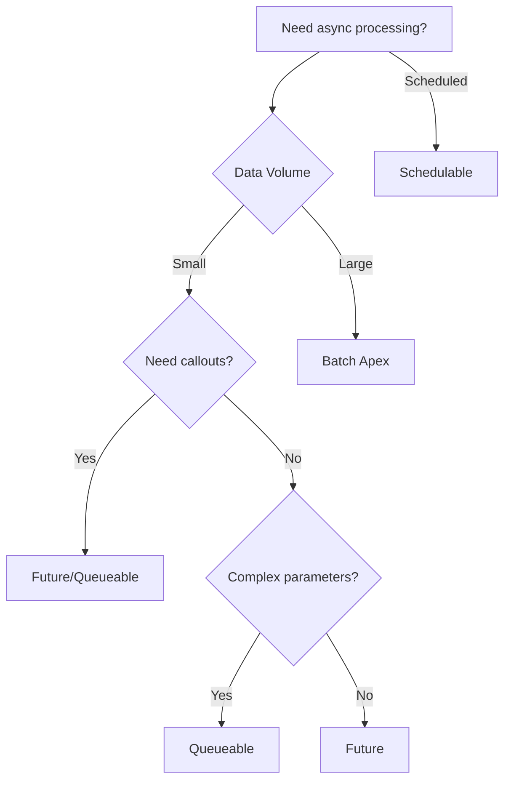

## 1. Introduction to Asynchronous Apex <a name="introduction"></a>
**Asynchronous Apex** allows long-running operations to be processed in the background:
- Executes independently of the main transaction
- Avoids user interface delays
- Handles large data volumes
- Works within Salesforce governor limits

### Why Use Asynchronous Processing?
- 🕒 **Performance**: Prevents timeouts for long operations
- 📈 **Scalability**: Processes large datasets efficiently
- 🛡️ **Governor Limit Management**: Higher limits for async operations
- 🔄 **Integration**: Makes callouts to external systems

### Synchronous vs. Asynchronous:
| Feature              | Synchronous Apex             | Asynchronous Apex             |
|----------------------|------------------------------|-------------------------------|
| **Execution**        | Immediate                    | Queued for later              |
| **User Experience**  | Blocks UI                    | No UI impact                  |
| **Max Runtime**      | 10 seconds (UI context)      | Up to 5 minutes (Batch)       |
| **Callouts**         | Not allowed after DML        | Allowed in most async contexts|
| **Governor Limits**  | Standard limits              | Higher limits                 |

---

## 2. Future Methods <a name="future-methods"></a>
**Future methods** run asynchronously in their own thread:
- Used for callouts, long operations, and mixed DML
- Defined with `@future` annotation
- Best for fire-and-forget operations

### Key Characteristics:
- Run when system resources are available
- No guaranteed execution order
- Parameters must be primitive types or collections
- Can't return values to calling code

### Syntax:
```apex
public class AsyncOperations {
    @future
    public static void processRecords(Set<Id> recordIds) {
        // Async logic here
    }
}
```

### Example: Mixed DML Solution
```apex
public class UserService {
    public static void createUserAndContact(String lastName) {
        // This would cause Mixed DML error in sync context
        createUser(lastName);
    }
    
    @future
    private static void createUser(String lastName) {
        Profile p = [SELECT Id FROM Profile WHERE Name='Standard User'];
        User u = new User(
            Alias = 'newuser',
            Email = 'user@example.com',
            LastName = lastName,
            ProfileId = p.Id,
            Username = 'user' + System.now().getTime() + '@example.com'
        );
        insert u;
    }
}
```

### Limitations:
- Cannot take sObjects as parameters
- Cannot be called from triggers with 100+ records
- No method chaining
- Difficult to track execution status

---

## 3. Queueable Apex <a name="queueable"></a>
**Queueable Apex** is an enhanced version of future methods:
- Implements `Queueable` interface
- Allows job chaining
- Accepts complex objects
- Provides job ID monitoring

### Key Advantages:
- Higher governor limits than future methods
- Job chaining with `System.enqueueJob()`
- Accepts sObjects as parameters
- Tracks job status via `AsyncApexJob`

### Basic Structure:
```apex
public class ProcessRecordsQueueable implements Queueable {
    private List<Account> accounts;
    
    // Constructor to pass data
    public ProcessRecordsQueueable(List<Account> accts) {
        this.accounts = accts;
    }
    
    // Execute method
    public void execute(QueueableContext context) {
        // Process records
        for(Account acc : accounts) {
            acc.Rating = 'Hot';
        }
        update accounts;
    }
}
```

### Execution:
```apex
// Enqueue job
List<Account> accts = [SELECT Id FROM Account WHERE CreatedDate = TODAY];
ID jobId = System.enqueueJob(new ProcessRecordsQueueable(accts));
```

### Job Chaining Example:
```apex
public class FirstJob implements Queueable {
    public void execute(QueueableContext context) {
        // Step 1 processing
        
        // Chain next job
        System.enqueueJob(new SecondJob());
    }
}

public class SecondJob implements Queueable {
    public void execute(QueueableContext context) {
        // Step 2 processing
    }
}
```

---

## 4. Batch Apex <a name="batch"></a>
**Batch Apex** processes large datasets in chunks:
- Implements `Database.Batchable` interface
- Handles millions of records
- Processes records in batches (default 200 records)
- Three distinct methods: start, execute, finish

### Use Cases:
- Data cleansing and deduplication
- Large-scale record updates
- Nightly batch processing
- Complex calculations across datasets

### Class Structure:
```apex
global class DataCleanupBatch implements Database.Batchable<sObject> {
    // Query locator
    global Database.QueryLocator start(Database.BatchableContext bc) {
        return Database.getQueryLocator(
            'SELECT Id, Name FROM Account WHERE LastModifiedDate < LAST_N_DAYS:365'
        );
    }
    
    // Process each batch
    global void execute(Database.BatchableContext bc, List<Account> scope) {
        List<Account> accountsToUpdate = new List<Account>();
        for(Account acc : scope) {
            acc.Status__c = 'Inactive';
            accountsToUpdate.add(acc);
        }
        update accountsToUpdate;
    }
    
    // Post-processing
    global void finish(Database.BatchableContext bc) {
        // Send email notification
        AsyncApexJob job = [SELECT Id, Status FROM AsyncApexJob WHERE Id = :bc.getJobId()];
        Messaging.SingleEmailMessage mail = new Messaging.SingleEmailMessage();
        mail.setSubject('Batch Job Completed: ' + job.Status);
        mail.setPlainTextBody('Records processed: ' + job.TotalJobItems);
        Messaging.sendEmail(new Messaging.SingleEmailMessage[] { mail });
    }
}
```

### Execution:
```apex
// Execute batch
DataCleanupBatch batch = new DataCleanupBatch();
Database.executeBatch(batch, 100); // 100 records per batch
```

### Stateful Batches:
```apex
global class StatefulBatch implements Database.Batchable<sObject>, Database.Stateful {
    global Integer totalRecords = 0;
    
    public void execute(Database.BatchableContext bc, List<Account> scope) {
        totalRecords += scope.size();
    }
    
    public void finish(Database.BatchableContext bc) {
        System.debug('Total records processed: ' + totalRecords);
    }
}
```

---

## 5. Schedulable Apex <a name="schedulable"></a>
**Schedulable Apex** executes code at specified times:
- Implements `Schedulable` interface
- Can schedule batch, queueable, or regular classes
- Runs as system user (bypasses permissions)
- Managed through Setup or code

### Scheduling Options:
1. **Setup UI**: Setup → Scheduled Jobs
2. **Apex Code**: `System.schedule()` method
3. **Cron Expressions**: Unix-style time syntax

### Basic Structure:
```apex
global class DailyReportScheduler implements Schedulable {
    global void execute(SchedulableContext sc) {
        // Call batch or other processing
        Database.executeBatch(new DailyReportBatch());
    }
}
```

### Scheduling Methods:
**Via Code:**
```apex
String cron = '0 0 2 * * ?'; // 2:00 AM daily
DailyReportScheduler scheduler = new DailyReportScheduler();
System.schedule('Daily Report Job', cron, scheduler);
```

**Via Setup:**
1. Setup → Apex Classes
2. Click "Schedule Apex"
3. Fill in job details

### Cron Expression Syntax:
`Seconds Minutes Hours Day_of_month Month Day_of_week Year`

| Field          | Values          | Special Characters |
|----------------|-----------------|--------------------|
| Seconds        | 0-59            | , - * /            |
| Minutes        | 0-59            | , - * /            |
| Hours          | 0-23            | , - * /            |
| Day of Month   | 1-31            | , - * ? / L W     |
| Month          | 1-12 or JAN-DEC | , - * /            |
| Day of Week    | 1-7 or SUN-SAT  | , - * ? / L #      |
| Year (Optional)| 1970-2099       | , - * /            |

### Common Cron Examples:
- Daily at 2:30 AM: `0 30 2 * * ?`
- Every Monday at 5 PM: `0 0 17 ? * MON`
- First day of month at midnight: `0 0 0 1 * ?`
- Every 15 minutes: `0 0/15 * * * ?`

---

## 6. Comparing Asynchronous Options <a name="comparison"></a>
| Feature                | Future Methods         | Queueable Apex        | Batch Apex            | Schedulable Apex      |
|------------------------|------------------------|-----------------------|-----------------------|-----------------------|
| **Execution Time**     | 1 minute               | 5 minutes             | 10 minutes per batch  | 15 minutes           |
| **Data Volume**        | Low                    | Medium                | Very High             | Depends on job type  |
| **Chaining**           | ❌ No                  | ✅ Yes                | ❌ No                 | ❌ No                |
| **State Maintenance**  | ❌ No                  | ✅ Yes                | ✅ Only stateful      | ❌ No                |
| **Parameter Support**  | Primitives only        | Complex objects       | Query-based           | Context only         |
| **Job Monitoring**     | Limited                | ✅ Yes                | ✅ Yes                | ✅ Yes               |
| **Use Cases**          | Callouts, Mixed DML    | Complex async tasks   | Large data processing | Scheduled jobs       |

### Decision Flow:


---

## 7. Governor Limits <a name="limits"></a>
### Key Async Limits:
| Resource               | Limit                         | Context             |
|------------------------|-------------------------------|---------------------|
| **Future Calls**       | 50 per transaction            | Synchronous context |
| **Queueable Chains**   | 1 chain per transaction       | Queueable context   |
| **Max Queue Depth**    | 5 chained jobs                | Queueable context   |
| **Batch Size**         | 2,000 records (default)       | Batch context       |
| **Batch Jobs**         | 5 concurrent jobs             | Organization        |
| **Heap Size**          | 12 MB (async)                 | All async contexts  |
| **SOQL Queries**       | 200 (async)                   | All async contexts  |
| **DML Statements**     | 150 (async)                   | All async contexts  |

### Best Practices for Limits:
1. **Batch Apex**:
   - Optimize start method queries
   - Use scope parameter for large datasets
   - Avoid SOQL in loops

2. **Queueable Apex**:
   - Chain jobs for long operations
   - Monitor queue depth
   - Handle governor limits explicitly

3. **Future Methods**:
   - Use for small operations
   - Avoid calling from bulk triggers
   - Track pending jobs

---

## 8. Error Handling <a name="error-handling"></a>
### Common Error Types:
1. **Unhandled Exceptions**: Crashes async job
2. **Governor Limit Exceptions**: Exceeds resource limits
3. **Callout Exceptions**: Failed HTTP requests
4. **Data Processing Errors**: Invalid record state

### Handling Strategies:
**Try-Catch Blocks:**
```apex
public void execute(QueueableContext context) {
    try {
        // Risky operation
    } catch(Exception e) {
        System.debug('Error: ' + e.getMessage());
        // Log error to custom object
        ErrorLogger.logError(e);
    }
}
```

**Database Savepoints (Batch):**
```apex
public void execute(Database.BatchableContext bc, List<Account> scope) {
    Savepoint sp = Database.setSavepoint();
    try {
        update scope;
    } catch(Exception e) {
        Database.rollback(sp);
        // Handle error
    }
}
```

**Retry Mechanisms (Queueable):**
```apex
public class RetryableJob implements Queueable {
    private Integer retryCount = 0;
    
    public void execute(QueueableContext context) {
        try {
            // Process records
        } catch(CalloutException e) {
            if(retryCount < 3) {
                retryCount++;
                System.enqueueJob(this);
            } else {
                // Max retries reached
            }
        }
    }
}
```

---

## 9. Testing Strategies <a name="testing"></a>
### Testing Async Operations:
**Test.startTest() and Test.stopTest():**
```apex
@isTest
private class AsyncTest {
    @isTest
    static void testQueueable() {
        // Setup data
        Account acc = new Account(Name='Test');
        insert acc;
        
        Test.startTest();
        System.enqueueJob(new ProcessAccountQueueable(acc.Id));
        Test.stopTest(); // Forces async to run
        
        // Verify results
        Account updatedAcc = [SELECT Rating FROM Account WHERE Id = :acc.Id];
        System.assertEquals('Hot', updatedAcc.Rating);
    }
}
```

**Testing Batch Apex:**
```apex
@isTest
static void testBatch() {
    // Create test data
    List<Account> accounts = new List<Account>();
    for(Integer i=0; i<200; i++) {
        accounts.add(new Account(Name='Test ' + i));
    }
    insert accounts;
    
    Test.startTest();
    DataCleanupBatch batch = new DataCleanupBatch();
    Database.executeBatch(batch);
    Test.stopTest();
    
    // Verify all accounts updated
    List<Account> updatedAccounts = [SELECT Status__c FROM Account];
    for(Account acc : updatedAccounts) {
        System.assertEquals('Inactive', acc.Status__c);
    }
}
```

**Testing Schedulable Jobs:**
```apex
@isTest
static void testScheduler() {
    Test.startTest();
    String jobId = System.schedule('TestScheduler', '0 0 0 1 1 ?', new DailyReportScheduler());
    Test.stopTest();
    
    // Verify job scheduled
    CronTrigger ct = [SELECT Id FROM CronTrigger WHERE Id = :jobId];
    System.assertNotEquals(null, ct);
}
```

---

## 10. Monitoring and Debugging <a name="monitoring"></a>
### Monitoring Tools:
1. **Setup UI**:
   - Setup → Apex Jobs
   - Setup → Scheduled Jobs
   - Setup → Bulk Data Load Jobs

2. **Developer Console**:
   - Debug → Open Execute Anonymous
   - Log Inspector

3. **SOQL Queries**:
   ```apex
   SELECT Id, Status, JobItemsProcessed, TotalJobItems, NumberOfErrors 
   FROM AsyncApexJob
   WHERE JobType IN ('BatchApexWorker', 'Queueable')
   ```

### Debugging Techniques:
1. **System.debug()**:
   ```apex
   System.debug('Processing account: ' + acc.Id);
   ```

2. **Debug Logs**:
   - Set trace flags for "Apex Jobs"
   - Monitor via Developer Console

3. **Custom Logging**:
   ```apex
   public class CustomLogger {
       public static void log(String message) {
           Log__c log = new Log__c(
               Message__c = message,
               Type__c = 'Async'
           );
           insert log;
       }
   }
   ```

---

## 11. Real-World Use Cases <a name="use-cases"></a>
### Case 1: Integration with External System
```apex
public class OrderSyncQueueable implements Queueable {
    private Set<Id> orderIds;
    
    public OrderSyncQueueable(Set<Id> orderIds) {
        this.orderIds = orderIds;
    }
    
    public void execute(QueueableContext context) {
        List<Order> orders = [SELECT Id, Status FROM Order WHERE Id IN :orderIds];
        Http http = new Http();
        HttpRequest req = new HttpRequest();
        req.setEndpoint('https://erp.example.com/orders');
        req.setMethod('POST');
        req.setBody(JSON.serialize(orders));
        
        HttpResponse res = http.send(req);
        if(res.getStatusCode() != 200) {
            // Handle error
        }
    }
}
```

### Case 2: Nightly Data Maintenance
```apex
global class DataArchiverBatch implements Database.Batchable<sObject> {
    global Database.QueryLocator start(Database.BatchableContext bc) {
        return Database.getQueryLocator(
            'SELECT Id FROM Log__c WHERE CreatedDate < LAST_N_DAYS:365'
        );
    }
    
    global void execute(Database.BatchableContext bc, List<Log__c> logs) {
        delete logs;
    }
    
    global void finish(Database.BatchableContext bc) {
        // Notify admin
    }
}

// Scheduled job
global class NightlyScheduler implements Schedulable {
    global void execute(SchedulableContext sc) {
        Database.executeBatch(new DataArchiverBatch(), 2000);
    }
}
```

### Case 3: Complex Calculation Engine
```apex
public class CommissionCalculatorQueueable implements Queueable {
    private Id accountId;
    private Date calculationDate;
    
    public CommissionCalculatorQueueable(Id accountId, Date calcDate) {
        this.accountId = accountId;
        this.calculationDate = calcDate;
    }
    
    public void execute(QueueableContext context) {
        // 1. Query related opportunities
        // 2. Calculate commissions
        // 3. Create commission records
        // 4. Chain next account calculation if needed
    }
}
```

---

## 12. Best Practices <a name="best-practices"></a>
### Design Principles:
1. **Idempotency**: Design jobs to be safely retriable
2. **Modularity**: Break large jobs into smaller queueable units
3. **State Management**: Use stateful batches or instance variables
4. **Error Resilience**: Implement comprehensive error handling

### Performance Optimization:
- Use selective WHERE clauses in batch start methods
- Limit heap usage with efficient data structures
- Avoid nested queries in loops
- Use `@ReadOnly` annotation for batch jobs without DML

### Security Considerations:
- Validate all inputs
- Use with sharing context when appropriate
- Secure callout endpoints
- Protect against SOQL injection

### Maintenance Tips:
- Implement monitoring dashboards
- Create alerting for job failures
- Document job purposes and schedules
- Regularly review job performance

---

## 13. Resources <a name="resources"></a>
### Official Documentation:
- [Asynchronous Apex Developer Guide](https://developer.salesforce.com/docs/atlas.en-us.apexcode.meta/apexcode/apex_async.htm)
- [Queueable Apex](https://developer.salesforce.com/docs/atlas.en-us.apexcode.meta/apexcode/apex_queueing_jobs.htm)
- [Batch Apex](https://developer.salesforce.com/docs/atlas.en-us.apexcode.meta/apexcode/apex_batch_interface.htm)

### Learning Resources:
- Trailhead: [Asynchronous Apex](https://trailhead.salesforce.com/content/learn/modules/asynchronous_apex)
- Salesforce Ben: [Batch Apex Best Practices](https://www.salesforceben.com/batch-apex-best-practices/)

### Tools:
- [Salesforce CLI](https://developer.salesforce.com/tools/sfdxcli)
- [Apex PMD](https://pmd.github.io/latest/pmd_userdocs_tools_apex.html)

### Books:
- "Advanced Apex Programming" by Dan Appleman
- "Salesforce Platform Enterprise Architecture" by Andrew Fawcett
