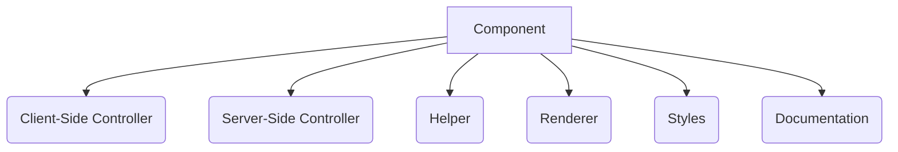
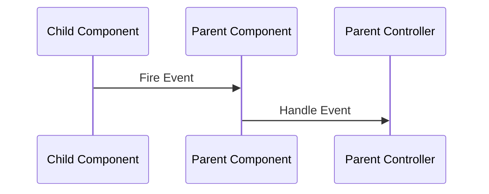

## 1. Introduction to Aura Components <a name="introduction"></a>
**Aura Components** are Salesforce's original UI framework for building:
- Single-page applications
- Custom Lightning apps
- Reusable UI elements
- Lightning App Builder components

**Key Characteristics:**
- Event-driven architecture
- Component-based development
- Supports modern JavaScript (ES6+)
- Uses Salesforce's proprietary Aura framework

**When to Use Aura:**
- Building complex applications with advanced event handling
- Needing backward compatibility with older Salesforce versions
- Creating components requiring global application events
- Extending Lightning Out for external websites

**Comparison with LWC:**
| Feature               | Aura Components             | LWC                      |
|-----------------------|----------------------------|--------------------------|
| Framework             | Proprietary (Aura)         | Web Standards            |
| Performance           | Moderate                   | High                     |
| Learning Curve        | Steeper                    | Easier (standard JS)     |
| Event Handling        | Complex event system       | Standard DOM events      |
| Shadow DOM            | Synthetic shadow           | Native shadow DOM        |

---

## 2. Aura Architecture <a name="architecture"></a>
### Core Layers:


### Key Concepts:
- **Component Bundles**: Collections of resources (.cmp, .js, etc.)
- **Event-Driven Model**: Component communication via events
- **Locker Service**: Security layer for DOM isolation
- **Synthetic Shadow DOM**: Virtual DOM implementation

---

## 3. Development Environment Setup <a name="setup"></a>
### Prerequisites:
- Salesforce Org (Developer Edition or Sandbox)
- VS Code with Salesforce Extensions
- Salesforce CLI

### Setup Process:
1. Install Salesforce CLI:
   ```bash
   npm install -g @salesforce/cli
   ```
2. Authenticate to Org:
   ```bash
   sf login org
   ```
3. Create Aura Component:
   ```bash
   sf force:lightning:component:create --type Aura --componentname HelloWorld --outputdir force-app/main/default/aura
   ```

### Project Structure:
```
force-app/
└── main/
    └── default/
        └── aura/
            ├── HelloWorld/
            │   ├── HelloWorld.cmp       // Component markup
            │   ├── HelloWorldController.js  // Client-side controller
            │   ├── HelloWorldHelper.js     // Shared JavaScript functions
            │   ├── HelloWorldRenderer.js   // Custom renderer
            │   ├── HelloWorld.css        // Component-specific styles
            │   └── HelloWorld.design     // Design attributes for App Builder
```

---

## 4. Component Structure <a name="structure"></a>
### Basic Component (.cmp file):
```html
<!-- HelloWorld.cmp -->
<aura:component>
    <!-- Attributes -->
    <aura:attribute name="greeting" type="String" default="Hello" />
    
    <!-- Event Registration -->
    <aura:registerEvent name="updateEvent" type="c:CustomEvent" />
    
    <!-- Component Markup -->
    <div class="container">
        <h1>{!v.greeting}, {!v.userName}!</h1>
        <lightning:button label="Click Me" onclick="{!c.handleClick}" />
    </div>
</aura:component>
```

### Key Elements:
- `<aura:attribute>`: Component properties
- `{!v.field}`: Value binding syntax
- `<aura:registerEvent>`: Declares events the component fires
- `{!c.action}`: References client-side controller methods

---

## 5. Component Bundles <a name="bundles"></a>
### Bundle Resources:
| File Type          | Purpose                          |
|--------------------|----------------------------------|
| `.cmp`             | Component markup definition      |
| `Controller.js`    | Client-side event handlers       |
| `Helper.js`        | Reusable JavaScript functions    |
| `Renderer.js`      | Custom rendering logic           |
| `.css`             | Component-specific styles        |
| `.design`          | Properties for Lightning App Builder |
| `.svg`             | Custom icon for App Builder      |
| `.auradoc`         | Component documentation          |

### Helper Example:
```javascript
// HelloWorldHelper.js
({
    formatName: function(firstName, lastName) {
        return firstName.toUpperCase() + ' ' + lastName.toUpperCase();
    }
})
```

### Controller Usage:
```javascript
// HelloWorldController.js
({
    handleClick: function(component, event, helper) {
        // Access component attributes
        let greeting = component.get("v.greeting");
        
        // Call helper function
        let fullName = helper.formatName('John', 'Doe');
        
        // Update component attribute
        component.set("v.userName", fullName);
    }
})
```

---

## 6. Attributes and Data Binding <a name="attributes"></a>
### Attribute Types:
```html
<aura:attribute name="age" type="Integer" default="30" />
<aura:attribute name="isActive" type="Boolean" default="true" />
<aura:attribute name="contact" type="Object" />
<aura:attribute name="contacts" type="List" />
<aura:attribute name="account" type="Account" /> <!-- SObject type -->
```

### Data Binding:
- **One-way binding**: `{!v.attributeName}`
- **Two-way binding**: Use expressions in input fields
  ```html
  <lightning:input 
      value="{!v.searchTerm}" 
      onchange="{!c.handleSearchChange}" />
  ```

### Expression Evaluation:
```html
<!-- Conditional rendering -->
<aura:if isTrue="{!v.isActive}">
    <p>User is active</p>
</aura:if>

<!-- List iteration -->
<aura:iteration items="{!v.contacts}" var="contact">
    <p>{!contact.Name}</p>
</aura:iteration>
```

---

## 7. Event Handling <a name="events"></a>
### Event Types:
1. **Component Events**: Communication between components in containment hierarchy
2. **Application Events**: Global communication across components

### Component Event Flow:


### Creating Custom Event:
```html
<!-- Event Definition (CustomEvent.evt) -->
<aura:event type="COMPONENT" description="Custom event">
    <aura:attribute name="message" type="String" />
</aura:event>
```

### Firing an Event:
```javascript
// Child Component Controller
handleClick: function(component) {
    let event = component.getEvent("updateEvent");
    event.setParams({ "message": "Data updated" });
    event.fire();
}
```

### Handling an Event:
```html
<!-- Parent Component -->
<c:childComponent onupdateEvent="{!c.handleUpdate}" />
```

```javascript
// Parent Controller
handleUpdate: function(component, event) {
    let message = event.getParam("message");
    console.log("Received: " + message);
}
```

---

## 8. Server-Side Controllers <a name="server"></a>
### Server-Side Actions:
```javascript
// Client Controller
handleSave: function(component) {
    let action = component.get("c.saveRecord");
    action.setParams({ 
        record: component.get("v.record") 
    });
    action.setCallback(this, function(response) {
        let state = response.getState();
        if (state === "SUCCESS") {
            console.log("Record saved");
        }
    });
    $A.enqueueAction(action);
}
```

### Apex Controller:
```java
// Apex Controller
@AuraEnabled
public static void saveRecord(Account record) {
    try {
        upsert record;
    } catch (Exception e) {
        throw new AuraHandledException(e.getMessage());
    }
}
```

### Response Handling States:
| State        | Description                          |
|--------------|--------------------------------------|
| `SUCCESS`    | Action completed successfully        |
| `INCOMPLETE` | Response not returned from server    |
| `ERROR`      | Server-side error occurred           |
| `ABORTED`    | Action aborted by another action     |

---

## 9. Apex Integration <a name="apex"></a>
### Calling Apex Methods:
1. **Direct Method Call**:
   ```javascript
   let action = component.get("c.getContacts");
   action.setParams({ accountId: component.get("v.recordId") });
   ```
   
2. **Using Lightning Data Service** (Preferred for CRUD):
   ```html
   <force:recordData 
       recordId="{!v.recordId}"
       targetFields="{!v.accountFields}"
       layoutType="FULL" />
   ```

### Caching Strategies:
- Use `@AuraEnabled(cacheable=true)` for read-only operations
- Enables client-side caching
- Can be called via `@wire` in LWC

### Example Cached Method:
```java
@AuraEnabled(cacheable=true)
public static List<Contact> getContacts(Id accountId) {
    return [SELECT Name, Email FROM Contact WHERE AccountId = :accountId];
}
```

---

## 10. Component Communication <a name="communication"></a>
### Communication Methods:
1. **Parent-to-Child**: Use component attributes
   ```html
   <!-- Parent -->
   <c:childComponent childAttribute="{!v.parentValue}" />
   ```
   
2. **Child-to-Parent**: Use component events

3. **Peer-to-Peer**: 
   - Application events
   - Lightning Message Service (LMS)

4. **Unrelated Components**:
   - Lightning Message Service (Preferred)
   - Application events (Legacy)

### Lightning Message Service:
```javascript
// Subscribe to message channel
subscribeToChannel: function(component) {
    const recordId = component.get("v.recordId");
    this.subscription = subscribe(
        this.messageContext,
        recordChannel,
        (message) => this.handleMessage(message)
    );
}

// Handle incoming message
handleMessage: function(message) {
    // Update component state
}
```

---

## 11. Rendering Lifecycle <a name="lifecycle"></a>
### Key Lifecycle Hooks:
| Phase              | Description                          |
|--------------------|--------------------------------------|
| `init`             | Component initialization            |
| `render`           | Renders component DOM               |
| `rerender`         | Updates after attribute changes     |
| `afterRender`      | Post-render processing              |
| `unrender`         | Component destruction               |

### Custom Renderer Example:
```javascript
// HelloWorldRenderer.js
({
    // Override render function
    render: function(component, helper) {
        let ret = this.superRender();
        // Custom rendering logic
        return ret;
    },
    
    // After DOM insertion
    afterRender: function(component, helper) {
        this.superAfterRender();
        // Add post-render logic
    }
})
```

---

## 12. Styling Components <a name="styling"></a>
### Scoped Styling:
```css
/* HelloWorld.css */
.THIS.container {
    padding: 12px;
    background-color: #f3f2f2;
}

.THIS .title {
    font-size: 1.5rem;
    color: #16325c;
}
```

### Global Styling:
1. Create static resource (CSS file)
2. Load in component:
   ```html
   <aura:component>
       <ltng:require styles="{!$Resource.GlobalStyles}" />
       <!-- component markup -->
   </aura:component>
   ```

### CSS Limitations:
- No support for pure CSS @import
- Limited support for pseudo-classes in synthetic shadow
- Use utility classes for consistent styling

---

## 13. Lightning Data Service (LDS) <a name="lds"></a>
### Benefits:
- Automatic record management
- Change notification propagation
- Reduced Apex code requirements

### Basic Usage:
```html
<force:recordData 
    recordId="{!v.recordId}"
    layoutType="FULL"
    targetRecord="{!v.accountRecord}"
    targetFields="{!v.accountFields}"
    mode="EDIT" />
```

### Record Operations:
```javascript
// Refresh record
component.find("recordLoader").reloadRecord();

// Save record
component.find("recordLoader").saveRecord(function(saveResult) {
    if (saveResult.state === "SUCCESS") {
        // Handle success
    }
});
```

---

## 14. Testing and Debugging <a name="testing"></a>
### Debugging Tools:
1. **Browser Console**: 
   ```javascript
   console.log("Value:", component.get("v.recordId"));
   ```
   
2. **$A Debug Mode**:
   ```javascript
   $A.set("debug", true); // Enables debug statements
   ```

3. **Lightning Inspector** (Chrome Extension)

### Testing Approaches:
1. **Jest Unit Tests**: For helper functions
2. **Aura Testing Service**:
   ```javascript
   $A.test.createComponent("c:myComponent", {}, function(component) {
       // Test logic
   });
   ```
3. **End-to-End Testing**: Provar, Selenium

---

## 15. Deployment <a name="deployment"></a>
### Deployment Methods:
1. **VS Code Deployment**:
   - Right-click folder → SFDX: Deploy Source to Org
   
2. **Salesforce CLI**:
   ```bash
   sf project deploy start -d force-app
   ```

3. **Change Sets** (Production Deployment):
   - Upload via Setup → Outbound Change Sets

### Deployment Considerations:
- API version compatibility
- Profile permissions
- CORS settings for external integrations
- CSP Trusted Sites for external resources

---

## 16. Best Practices <a name="best-practices"></a>
### Performance:
- Minimize server trips using bulkification
- Use `cacheable=true` for read-only operations
- Limit use of application events

### Security:
- Use `@AuraEnabled` carefully
- Validate all user inputs
- Avoid client-side sensitive data storage

### Code Quality:
- Modularize helper functions
- Use consistent naming conventions
- Document complex logic
- Follow Aura coding standards

### Error Handling:
```javascript
action.setCallback(this, function(response) {
    let state = response.getState();
    if (state === "ERROR") {
        let errors = response.getError();
        $A.error("Error message: " + errors[0].message);
    }
});
```

---

## 17. Migration to LWC <a name="migration"></a>
### Migration Path:
1. **Coexistence Approach**:
   - Wrap Aura components in LWC (`<lightning:container>`)
   - Wrap LWC in Aura (`<c:lwcComponent>`)

2. **Full Rewrite**:
   - Convert Aura bundles to LWC equivalents
   - Replace Aura events with standard DOM events

### Migration Tools:
- **Aura Inspector**: Analyze component dependencies
- **Salesforce CLI Scanner**:
  ```bash
  sf scanner run --target ./force-app --format html
  ```
- **LWC Recipes**: Reference implementations

### Key Conversion Points:
| Aura Concept          | LWC Equivalent          |
|-----------------------|-------------------------|
| `aura:attribute`      | `@api` properties       |
| Component events      | `CustomEvent()`         |
| Application events    | `pubsub` or LMS         |
| `value="{!v.field}"`  | `value={field}`         |
| `onclick="{!c.handler}"` | `onclick={handler}`   |

---

## 18. Resources <a name="resources"></a>
### Official Documentation:
- [Aura Components Developer Guide](https://developer.salesforce.com/docs/atlas.en-us.lightning.meta/lightning)
- [Component Reference](https://developer.salesforce.com/docs/component-library)

### Learning Platforms:
- Trailhead: [Aura Components Basics](https://trailhead.salesforce.com/content/learn/modules/lex_dev_lc_basics)
- Salesforce Developer Blog

### Tools:
- [Lightning Web Security Playground](https://webcomponents.dev/)
- [Salesforce CLI](https://developer.salesforce.com/tools/sfdxcli)

### Community Support:
- [Salesforce Stack Exchange](https://salesforce.stackexchange.com)
- [Trailblazer Community Groups](https://trailhead.salesforce.com/trailblazer-community)
