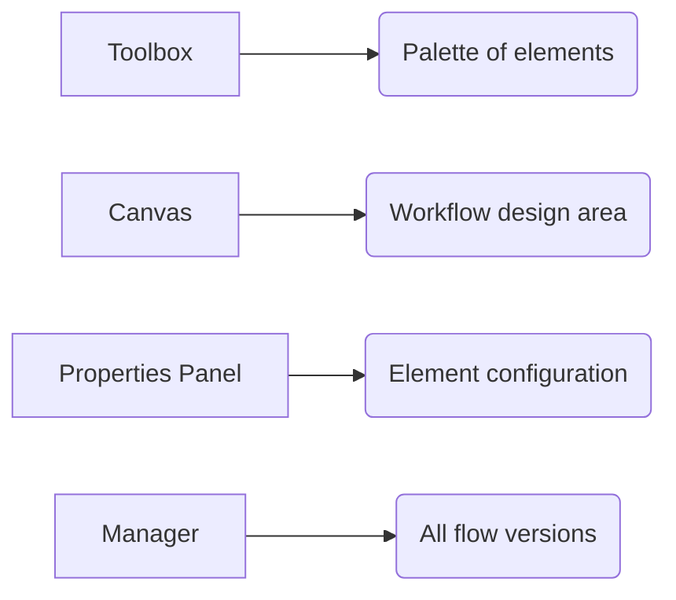
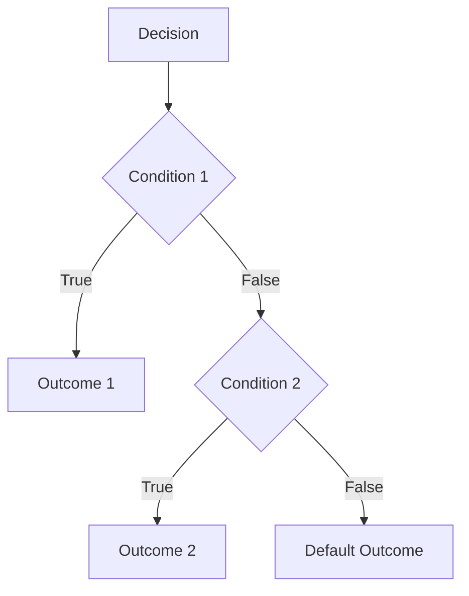
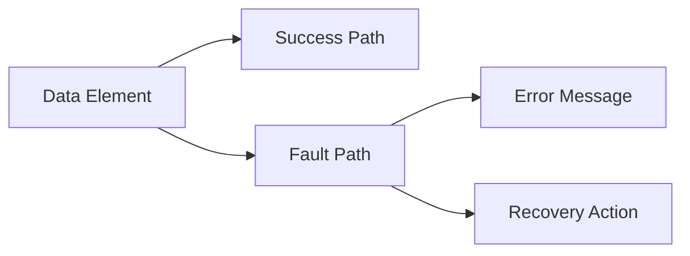
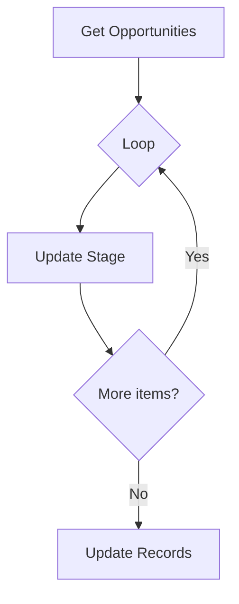
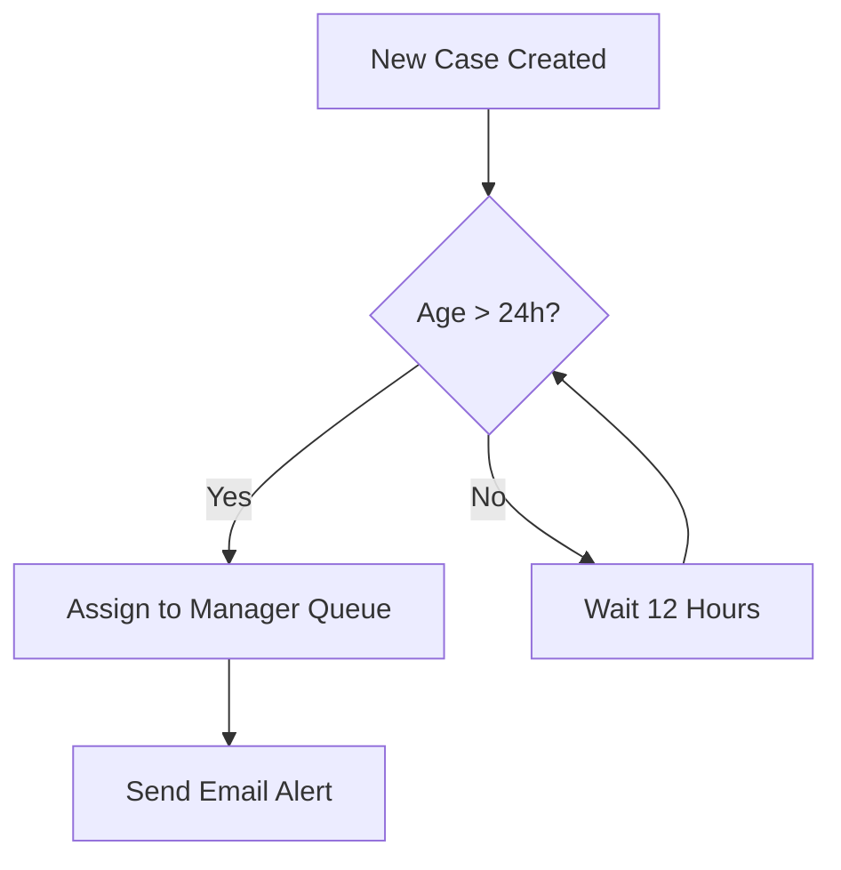
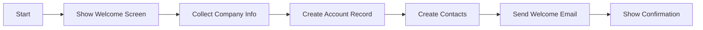

## 1. Introduction to Flow Builder <a name="introduction"></a>
**Salesforce Flow Builder** is a declarative automation tool that:
- Automates business processes with clicks, not code
- Replaces Workflow Rules and Process Builder
- Handles complex logic with visual interfaces
- Works across multiple Salesforce objects
- Supports both screen-based and background automations

**Key Benefits:**
- 🚀 **Accelerated development**: Build complex automations faster than code
- 🔄 **Flexibility**: Combine UI screens with backend logic
- 📊 **Unified automation**: Replaces multiple legacy tools
- 🌐 **Omnichannel**: Works in Lightning, Mobile, and Experience Cloud

**Flow Builder vs. Other Tools:**
| Feature          | Flow Builder             | Process Builder        | Workflow Rules         |
|------------------|--------------------------|------------------------|------------------------|
| Complex Logic    | ✅ Excellent             | ⚠️ Limited             | ❌ Basic               |
| Screen Flows     | ✅ Supported             | ❌ Not supported       | ❌ Not supported       |
| Object Support   | ✅ Multi-object          | ⚠️ Single object       | ⚠️ Single object      |
| Trigger Actions  | ✅ All DML operations    | ⚠️ Create/update only | ⚠️ Field updates only |

---

## 2. Flow Types and Use Cases <a name="flow-types"></a>
### Flow Categories:
1. **Screen Flows**:
   - Guided UI experiences for users
   - Example: Onboarding wizard, service request forms
   
2. **Autolaunched Flows**:
   - Run in background (no UI)
   - Example: Record updates, complex calculations

3. **Scheduled Flows**:
   - Run at specific times/recurrences
   - Example: Daily data cleanup, weekly reports

4. **Platform Event-Triggered Flows**:
   - Respond to event messages
   - Example: Real-time integrations

### Common Use Cases:
- Customer onboarding journeys
- Approval automation
- Data validation and enrichment
- Self-service portals
- Complex record updates across objects

---

## 3. Flow Builder Interface <a name="interface"></a>
### Key Interface Areas:


### Navigation Features:
- **Element Palette**: Drag-and-drop components
- **Canvas**: Visual workflow builder
- **Toolbar**: Save, run, debug options
- **Resources Panel**: Manage variables and formulas
- **Version Control**: Track changes over time

---

## 4. Core Flow Elements <a name="elements"></a>
### Logic Elements:
| Element          | Purpose                          | Example Use              |
|------------------|----------------------------------|--------------------------|
| **Assignment**   | Set variable values              | Set default values       |
| **Decision**     | Branch logic (if/then)           | Route based on criteria  |
| **Loop**         | Iterate through collections      | Process multiple records |
| **Wait**         | Pause flow execution             | Wait for user input      |

### Data Elements:
| Element          | Purpose                          |
|------------------|----------------------------------|
| **Get Records**  | Retrieve Salesforce data         |
| **Create Records**| Make new records                |
| **Update Records**| Modify existing records         |
| **Delete Records**| Remove records                  |

### Action Elements:
| Element          | Purpose                          |
|------------------|----------------------------------|
| **Apex Action**  | Call custom Apex code           |
| **Subflow**      | Call another flow               |
| **Action**       | Call predefined actions         |
| **Email Alert**  | Send notification emails        |

---

## 5. Variables and Formulas <a name="variables"></a>
### Variable Types:
| Type             | Description                      | Example                |
|------------------|----------------------------------|------------------------|
| **Text**         | String values                    | Customer name         |
| **Number**       | Numeric values                   | Discount percentage   |
| **Boolean**      | True/False values                | Is eligible?          |
| **Record**       | SObject record                   | Account record        |
| **Collection**   | List of records/variables        | List of opportunities |

### Formula Syntax:
```javascript
// Combine text fields
{!$User.FirstName & " " & $User.LastName}

// Conditional logic
IF({!contact.Age} >= 65, "Senior", "Standard")

// Date math
TODAY() + 30  // 30 days from today
```

### Global Variables:
- `$GlobalConstant`: System values (e.g., $GlobalConstant.True)
- `$User`: Current user info
- `$Organization`: Company details
- `$Record`: Record triggering flow

---

## 6. Data Management <a name="data"></a>
### Record Operations:
**Get Records Example:**
```sql
// Get related contacts
Object: Contact
Conditions: AccountId = {!account.Id}
Sort Order: LastName ASC
Limit: 50
```

**Update Records Example:**
```sql
// Update opportunity stage
Object: Opportunity
Filter: Id Equals {!opportunityId}
Field: StageName → 'Closed Won'
```

### Best Practices:
- Use **fault paths** for all data operations
- Limit record collections to < 2000 records
- Use **Fast Lookups** for single-record retrieval
- Optimize SOQL with filters

---

## 7. Screen Components <a name="screens"></a>
### Core Components:
| Component        | Purpose                          |
|------------------|----------------------------------|
| **Text Input**   | Capture text/number input        |
| **Radio Group**  | Single selection from options    |
| **Checkbox**     | Toggle true/false value          |
| **Picklist**     | Dropdown selection               |
| **Rich Text**    | Formatted content display        |

### Screen Layout Options:
1. **Single Column**: Simple vertical layout
2. **Two Columns**: Side-by-side components
3. **Custom Layouts**: Using Lightning Web Components

### Screen Flow Example:
```markdown
1. Welcome Screen → Rich Text: "Complete your registration"
2. User Input → Text Input: "Enter your phone number"
3. Validation → Decision: Is phone valid?
   - Yes → Continue to next screen
   - No → Show error message
```

---

## 8. Decision Logic <a name="decisions"></a>
### Decision Structure:


### Condition Types:
1. **Simple Conditions**:
   ```sql
   {!opportunity.Amount} > 10000
   ```
   
2. **Complex Conditions**:
   ```sql
   ({!contact.Age} >= 65) && 
   ({!contact.Status} = "Active")
   ```
   
3. **Formulas in Conditions**:
   ```sql
   {!contact.LastModifiedDate} > TODAY() - 30
   ```

---

## 9. Error Handling <a name="errors"></a>
### Fault Paths:


### Error Handling Strategies:
1. **Display Custom Errors**:
   ```javascript
   "Failed to create record: " & {!$Flow.FaultMessage}
   ```
   
2. **Retry Mechanisms**:
   ```mermaid
   sequenceDiagram
       Attempt 1->>System: Create Record
       System-->>Attempt 1: Error
       Attempt 2->>System: Retry Operation
   ```
   
3. **Fallback Actions**:
   - Send email to admin
   - Create error log record
   - Redirect to alternative screen

---

## 10. Debugging and Testing <a name="debugging"></a>
### Debugging Tools:
1. **Debug Logs**:
   - View execution details
   - Inspect variable values
   
2. **Test Button**:
   - Run flows with sample data
   - Available in Flow Builder

3. **Pause Diagnostics**:
   - Check element outputs mid-flow
   - Available in debug mode

### Testing Checklist:
- Test all decision branches
- Validate boundary conditions
- Test with invalid data inputs
- Verify bulk record handling
- Check governor limits

---

## 11. Integration with Salesforce <a name="integration"></a>
### Triggering Flows:
| Method                   | Description                      |
|--------------------------|----------------------------------|
| **Record-Triggered**     | On create/update/delete         |
| **Button/Link**          | From UI actions                 |
| **Process Builder**      | Legacy integration              |
| **Apex**                 | `Flow.Interview` class          |
| **Scheduled Path**       | Time-based execution            |

### Integration Points:
- **Lightning Pages**: Embed flows in Lightning Apps
- **Experience Cloud**: Add to community pages
- **OmniStudio**: Integrate with digital journeys
- **Apex**: Call flows from code:
  ```java
  Flow.Interview myFlow = Flow.Interview.createInterview(flowName, params);
  myFlow.start();
  ```

---

## 12. Advanced Features <a name="advanced"></a>
### Collections and Loops:


### Invocable Actions:
1. Create custom Apex classes:
   ```java
   @InvocableMethod(label='Calculate Discount')
   public static List<Decimal> calculateDiscount(List<Id> opportunityIds) {
       // Custom logic
   }
   ```
   
2. Call from Flow Builder using **Apex Action** element

### Local Actions:
- Reusable flow components
- Create once, reference multiple times
- Simplify complex flows

---

## 13. Best Practices <a name="best-practices"></a>
### Performance Optimization:
- Use **Fast Field Updates** for single-field changes
- Limit SOQL queries with precise filters
- Avoid nested loops with large collections
- Use **Decision Elements** before data operations

### Maintainability:
- Name all elements clearly
- Use **Annotations** for complex logic
- Create modular subflows
- Document with **Description** fields

### Governor Limits:
| Limit                     | Value               |
|---------------------------|---------------------|
| Total SOQL queries        | 200                 |
| Total DML statements      | 150                 |
| Heap size                 | 6 MB/12 MB          |
| Collection size           | 100,000 elements    |

---

## 14. Version Control and Deployment <a name="deployment"></a>
### Version Management:
1. Activate new versions
2. Track change history
3. Test before activation
4. Roll back to previous versions

### Deployment Methods:
1. **Change Sets**: Migrate between sandboxes
2. **Salesforce CLI**:
   ```bash
   sf project deploy start -d flows/
   ```
3. **ANT Migration Tool**: For metadata API
4. **Packaging**: For managed packages

### CI/CD Considerations:
- Include flows in version control
- Use sandbox testing environments
- Validate flow dependencies
- Test after deployments

---

## 15. Real-World Examples <a name="examples"></a>
### Example 1: Case Escalation Flow


### Example 2: Account Onboarding Flow


### Example 3: Lead Qualification Flow
1. Get lead details
2. Score lead based on:
   - Industry
   - Company size
   - Budget
3. Route to appropriate sales team
4. Create follow-up task

---

## 16. Resources <a name="resources"></a>
### Official Documentation:
- [Flow Builder Developer Guide](https://help.salesforce.com/s/articleView?id=sf.flow.htm&type=5)
- [Flow Best Practices](https://architect.salesforce.com/flow-best-practices)

### Learning Platforms:
- Trailhead: [Automate Business Processes with Flow](https://trailhead.salesforce.com/content/learn/modules/automate-business-processes-flows)
- Salesforce Ben: [Flow Academy](https://www.salesforceben.com/flow-academy/)

### Tools:
- [Flow Screen Components](https://developer.salesforce.com/docs/component-library/bundle/lightning-flow-support)
- [Flow Error Parser](https://flowinspection.com)

### Community:
- [Salesforce Flow Community Group](https://trailhead.salesforce.com/trailblazer-community/groups/0F93A000000LgXKSA0)
- [Salesforce Stack Exchange](https://salesforce.stackexchange.com/questions/tagged/flow)
