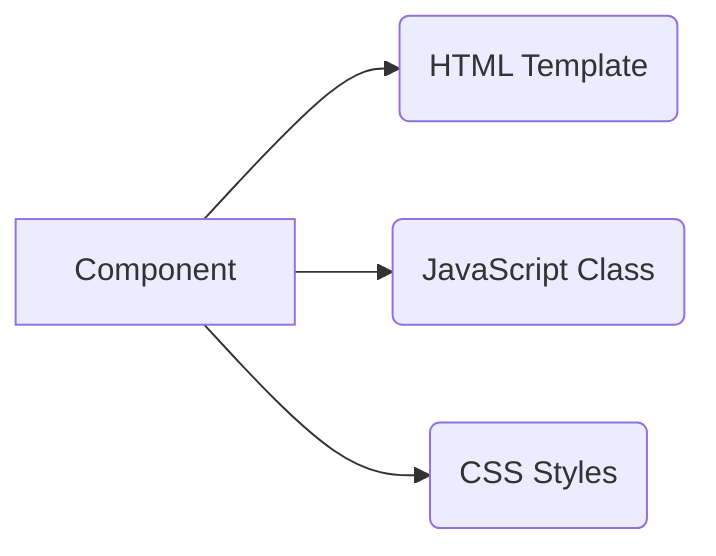
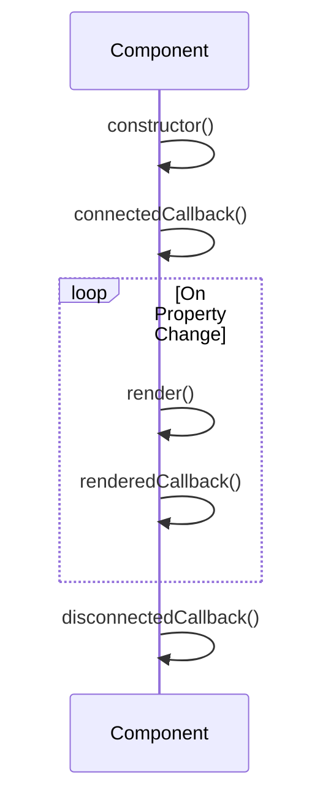

## 1. Introduction to LWC <a name="introduction"></a>
**Lightning Web Components (LWC)** is Salesforce's modern JavaScript framework built on **Web Standards**:
- Uses native browser capabilities (Custom Elements, Shadow DOM)
- Lightweight and high performance
- Interoperates with Aura components
- Designed for **mobile-first** experiences

**Key Advantages:**
- ⚡ Faster rendering using native browser APIs
- 📦 Modular architecture
- 🔒 Secure by default (Locker Service)
- 🛠️ Simplified development model

**When to Use LWC:**
- Building custom Salesforce apps
- Creating reusable UI components
- Enhancing Lightning App Builder
- Developing dynamic Lightning pages

---

## 2. Core Architecture <a name="architecture"></a>
### Component Model


### Key Layers:
1. **HTML Templates**: Declarative UI using HTML + directives
2. **JavaScript**: ES6+ classes with decorators
3. **CSS**: Scoped styles via Shadow DOM

### Security Model
- **Locker Service**: Enforces strict security boundaries
- Components run in **isolated namespaces**
- Prevents DOM access between components

---

## 3. Development Environment Setup <a name="setup"></a>
### Prerequisites
- Salesforce Org (Scratch Org recommended)
- VS Code + Salesforce Extension Pack
- Salesforce CLI

### Setup Steps:
1. Install CLI: `npm install -g @salesforce/cli`
2. Authenticate Org: `sf login org`
3. Create Project:
   ```bash
   sf project generate --name MyLWCProject
   cd MyLWCProject
   ```
4. Create Component:
   ```bash
   sf lightning generate component --name HelloWorld --type lwc
   ```

### Project Structure:
```
my-lwc-project/
├── force-app/
│   └── main/
│       └── default/
│           ├── lwc/
│           │   ├── helloWorld/
│           │   │   ├── helloWorld.html
│           │   │   ├── helloWorld.js
│           │   │   ├── helloWorld.css
│           │   │   └── helloWorld.js-meta.xml
```

---

## 4. Component Structure <a name="structure"></a>
### Required Files:
1. **HTML File**: `<template>` root element
   ```html
   <!-- helloWorld.html -->
   <template>
       <h1>Hello, {name}!</h1>
   </template>
   ```
   
2. **JavaScript File**: ES6 class extending `LightningElement`
   ```javascript
   // helloWorld.js
   import { LightningElement } from 'lwc';
   export default class HelloWorld extends LightningElement {
       name = 'Salesforce Developer';
   }
   ```
   
3. **Configuration File** (XML):
   ```xml
   <!-- helloWorld.js-meta.xml -->
   <LightningComponentBundle>
       <apiVersion>59.0</apiVersion>
       <isExposed>true</isExposed>
       <targets>
           <target>lightning__HomePage</target>
       </targets>
   </LightningComponentBundle>
   ```

---

## 5. HTML Templates <a name="html"></a>
### Directives:
| Directive | Example | Purpose |
|-----------|---------|---------|
| `if:true` | `<template if:true={isVisible}>` | Conditional rendering |
| `for:each`| `<li for:each={items} for:item="item">` | List iteration |
| `iterator`| `<template iterator:it={items}>` | Advanced iteration |

### Example: Conditional Rendering
```html
<template>
    <template if:true={user.isActive}>
        <p>Welcome back, {user.name}!</p>
    </template>
    <template if:false={user.isActive}>
        <p>Account inactive</p>
    </template>
</template>
```

---

## 6. JavaScript Fundamentals <a name="javascript"></a>
### Core Concepts:
- **ES6 Classes**: Component logic
- **Modules**: Import/export syntax
- **Reactivity**: Automatic UI updates

### Example Component:
```javascript
import { LightningElement, track } from 'lwc';

export default class TaskManager extends LightningElement {
    @track tasks = [];
    newTask = '';

    handleInputChange(event) {
        this.newTask = event.target.value;
    }

    addTask() {
        this.tasks = [...this.tasks, this.newTask];
        this.newTask = '';
    }
}
```

---

## 7. Decorators <a name="decorators"></a>
### Core Decorators:
| Decorator | Purpose | Example |
|-----------|---------|---------|
| `@api` | Expose public property/method | `@api recordId;` |
| `@track` | Make object properties reactive | `@track address = { city: '' }` |
| `@wire` | Read Salesforce data | `@wire(getRecord, { recordId: '$recordId' })` |

### Example:
```javascript
import { LightningElement, api, wire } from 'lwc';
import getContactDetails from '@salesforce/apex/ContactController.getContactDetails';

export default class ContactCard extends LightningElement {
    @api recordId; // Passed from parent
    
    @wire(getContactDetails, { contactId: '$recordId' })
    contact;
}
```

---

## 8. CSS Styling <a name="css"></a>
### Scoped Styles:
- Styles only affect component's DOM
- Use `:host` selector for wrapper styling

### Example:
```css
/* contactCard.css */
:host {
    display: block;
    border: 1px solid #d8dde6;
    border-radius: 4px;
    padding: 12px;
}

.card-header {
    font-size: 1.2rem;
    color: #16325c;
    margin-bottom: 8px;
}
```

### Global Styles:
- Use `lightning-global-styles` for shared CSS
- Define in `staticresources`

---

## 9. Data Binding <a name="binding"></a>
### One-Way Binding:
```html
<!-- Display value -->
<p>Total: {totalAmount}</p>

<!-- Attribute binding -->
<lightning-input 
    label="Search" 
    value={searchKey}>
</lightning-input>
```

### Two-Way Binding Pattern:
```javascript
// JavaScript
handleInputChange(event) {
    this.searchTerm = event.target.value;
}
```

```html
<!-- HTML -->
<lightning-input 
    value={searchTerm}
    onchange={handleInputChange}>
</lightning-input>
```

---

## 10. Event Handling <a name="events"></a>
### Event Types:
1. **DOM Events**: `onclick`, `onchange`
2. **Component Events**: Custom events
3. **Application Events**: Via `pubsub` module

### Custom Event Example:
**Child Component:**
```javascript
// childComponent.js
handleClick() {
    const selectEvent = new CustomEvent('itemselect', {
        detail: { itemId: this.item.id }
    });
    this.dispatchEvent(selectEvent);
}
```

**Parent Component:**
```html
<!-- parent.html -->
<c-child-component onitemselect={handleItemSelect}></c-child-component>
```

```javascript
// parent.js
handleItemSelect(event) {
    console.log('Selected ID:', event.detail.itemId);
}
```

---

## 11. Working with Apex <a name="apex"></a>
### Two Methods:
1. **Wire Service** (Reactive)
2. **Imperative Calls** (Direct invocation)

### Wire Method Example:
```javascript
import { LightningElement, wire } from 'lwc';
import getOpportunities from '@salesforce/apex/OpportunityController.getOpportunities';

export default class OppList extends LightningElement {
    @wire(getOpportunities, { stage: 'Closed Won' })
    opportunities;
}
```

### Imperative Call Example:
```javascript
import { LightningElement } from 'lwc';
import getAccounts from '@salesforce/apex/AccountController.getAccounts';

export default class AccountSearch extends LightningElement {
    accounts = [];
    
    loadAccounts() {
        getAccounts({ searchTerm: this.searchKey })
            .then(result => {
                this.accounts = result;
            })
            .catch(error => {...});
    }
}
```

---

## 12. Lifecycle Hooks <a name="lifecycle"></a>
### Key Hooks:
| Hook | Purpose |
|------|---------|
| `constructor()` | Initialize state |
| `connectedCallback()` | DOM insertion |
| `renderedCallback()` | After rendering |
| `disconnectedCallback()` | DOM removal |
| `errorCallback()` | Handle errors |

### Flow Diagram:


---

## 13. Testing LWC <a name="testing"></a>
### Testing Tools:
- **Jest**: Unit tests
- **Salesforce CLI**: Test execution
- **Lightning Testing Service**: Mocking

### Sample Jest Test:
```javascript
// helloWorld.test.js
import { createElement } from 'lwc';
import HelloWorld from 'c/helloWorld';

describe('c-hello-world', () => {
    afterEach(() => {
        while (document.body.firstChild) {
            document.body.removeChild(document.body.firstChild);
        }
    });

    it('displays greeting', () => {
        const element = createElement('c-hello-world', {
            is: HelloWorld
        });
        document.body.appendChild(element);
        
        const div = element.shadowRoot.querySelector('h1');
        expect(div.textContent).toBe('Hello, Salesforce Developer!');
    });
});
```

---

## 14. Deployment <a name="deployment"></a>
### Deployment Methods:
1. **VS Code Deployment**: 
   - Right-click file → **SFDX: Deploy Source to Org**
2. **CLI Commands**:
   ```bash
   sf project deploy start -d force-app
   ```
3. **Change Sets**: (Sandbox → Production)
4. **Packaging**: For managed/unmanaged packages

### Deployment Considerations:
- API version compatibility
- User permissions
- Component visibility (`isExposed` in meta.xml)

---

## 15. Best Practices <a name="best-practices"></a>
### Performance:
- Minimize `renderedCallback` usage
- Use `@wire` for reactive data
- Lazy load non-critical components

### Code Quality:
- Single responsibility components
- Reusable utility functions
- Follow ESLint rules

### Security:
- Avoid `innerHTML` with user input
- Use Salesforce base components (e.g., `<lightning-input>`)
- Validate Apex parameters

### Error Handling:
```javascript
try {
    const result = await getData({ params });
} catch (error) {
    this.error = error.body.message;
}
```

---

## 16. Resources <a name="resources"></a>
### Official Documentation:
- [LWC Dev Guide](https://developer.salesforce.com/docs/component-library/documentation/en/lwc)
- [Component Library](https://developer.salesforce.com/docs/component-library)

### Learning Paths:
- Trailhead: [Lightning Web Components Basics](https://trailhead.salesforce.com/content/learn/modules/lightning-web-components-basics)

### Tools:
- [LWC Playground](https://webcomponents.dev/)
- [Salesforce CLI](https://developer.salesforce.com/tools/sfdxcli)

### Community:
- [Salesforce Stack Exchange](https://salesforce.stackexchange.com/)
- [Trailblazer Community](https://trailhead.salesforce.com/trailblazer-community)
