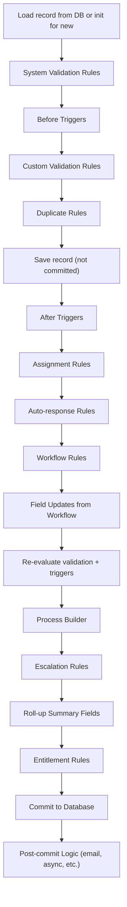

## 📌 What is Order of Execution?

In Salesforce, **Order of Execution** refers to the **sequence in which events occur when a record is saved** (inserted, updated, or deleted). Understanding this order is crucial when writing **triggers**, **validation rules**, **workflow rules**, **process builders**, or **flows**, because multiple automation tools can act on the same record.

---

## 🔄 High-Level Flow (Summary)

When a DML operation (insert/update/delete) is performed, Salesforce executes the following in order:

1. **System Validation Rules**
2. **Before Triggers**
3. **Custom Validation Rules**
4. **Duplicate Rules**
5. **After Triggers**
6. **Assignment Rules**
7. **Auto-response Rules**
8. **Workflow Rules**
9. **Processes (Process Builder)**
10. **Escalation Rules**
11. **Roll-up Summary Fields**
12. **Entitlement Rules**
13. **Post-commit logic (like sending email)**

---

## 📘 Detailed Order of Execution Steps

### ✅ Step-by-Step Breakdown

---

## 🔍 Explanation of Key Steps

### 1. **Load Record**

* For updates, loads the existing record from the database.
* For inserts, initializes a new record.

### 2. **System Validation Rules**

* Checks system-required fields (e.g., mandatory fields).
* Enforces data types and field formats.

### 3. **Before Triggers**

* Executes `before insert`, `before update`, etc.
* Ideal for data modification **before saving to DB**.

> **Example**: Updating a custom field's value like `Total__c = Quantity__c * Price__c`.

### 4. **Custom Validation Rules**

* Enforces business rules (defined in Setup).

> **Example**: A field "Discount" cannot exceed 30%.

### 5. **Duplicate Rules**

* Checks for duplicate records based on matching rules.

### 6. **Record Saved (but not committed)**

* Record is temporarily saved (not yet committed to DB).

### 7. **After Triggers**

* Executes `after insert`, `after update`, etc.
* Ideal for tasks like logging, sending notifications, or creating related records.

> **Example**: After inserting a Contact, create a related Task.

### 8. **Assignment Rules**

* For Leads or Cases only.
* Assigns records to users or queues.

### 9. **Auto-response Rules**

* Sends predefined email responses (e.g., case creation confirmation).

### 10. **Workflow Rules**

* Evaluates criteria and executes:

  * Field Updates
  * Email Alerts
  * Outbound Messages
  * Tasks

### 11. **Workflow Field Updates**

* If these update fields, triggers and validation rules are **re-evaluated** recursively.

> ⚠️ Can cause recursion issues if not properly managed.

### 12. **Processes (Process Builder)**

* Executed after workflow field updates.
* Can update related records, call Apex, submit for approval, etc.

### 13. **Escalation Rules**

* Only for Cases.
* Escalate the case according to defined rules.

### 14. **Roll-up Summary Fields**

* Parent record fields recalculated based on child records.

### 15. **Entitlement Rules**

* Used in Service Cloud to determine case entitlements.

### 16. **Record Committed to Database**

* Final save occurs here.
* All changes are now **permanently stored**.

### 17. **Post-commit Logic**

Includes:

* Email sends
* Asynchronous Apex (@future)
* Queueable/Batch Apex
* Outbound messages

---

## ⚠️ Important Notes

* **Triggers can cause recursion** if they update the same record again. Use static variables or recursion guards.
* **Order matters** when building automation. For example:

  * If a workflow updates a field that triggers another process, understand it might re-enter validation and trigger logic again.
* **Test thoroughly** to avoid infinite loops or unexpected behavior.

---

## 🎯 Real-world Example

**Use Case**: You create a new `Lead` with `Company = 'TestCorp'`.

Here’s what happens:

1. System checks required fields like `LastName`, `Company`.
2. `before insert` trigger sets `Status = 'New'`.
3. Validation Rule checks if email format is valid.
4. Duplicate rule finds no match.
5. Record is saved temporarily.
6. `after insert` trigger logs the Lead creation.
7. Lead assignment rule assigns to a Sales Rep.
8. Auto-response email is sent.
9. Workflow rule sets `Rating = 'Hot'`.
10. Field update triggers `before update`, `after update` again.
11. Process Builder sends a Slack notification.
12. Final record is saved to DB.
13. Email alert is sent post-commit.

---

## 🧠 Tips for Memorization

| Step  | Mnemonic            | Description                |
| ----- | ------------------- | -------------------------- |
| 1-2   | **S**ystem          | System validations         |
| 3     | **B**efore Trigger  | Pre-save logic             |
| 4     | **V**alidation      | Custom business rules      |
| 5     | **D**uplicates      | Prevent duplicates         |
| 6     | **S**ave            | Temporary save             |
| 7     | **A**fter Trigger   | Post-save logic            |
| 8-9   | **A**ssign + Auto   | Assignment & Auto-response |
| 10-11 | **W**orkflow        | Rules and updates          |
| 12    | **P**rocess Builder | Flows and logic            |
| 13    | **E**scalation      | Escalation rules           |
| 14    | **R**oll-up         | Summary fields             |
| 15    | **E**ntitlement     | Case entitlement           |
| 16    | **C**ommit          | Final save                 |
| 17    | **P**ost-commit     | Async jobs/emails          |

🔠 Mnemonic:
**S**mart **B**usinesses **V**alue **D**ata **S**afety **A**fter **A**ctions **W**ith **P**roper **E**xecution **R**ules **E**nsuring **C**orrect **P**rocessing

---

## 📝 Final Notes

* This topic is **highly testable** in admin, developer, and architect certifications.
* Always consider the **impact of each automation** tool in the flow.
* Use **debug logs** to analyze the exact order of operations during development.

---

