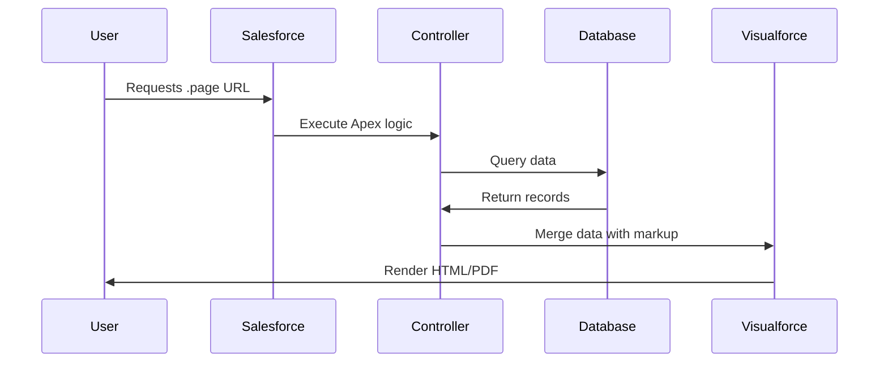
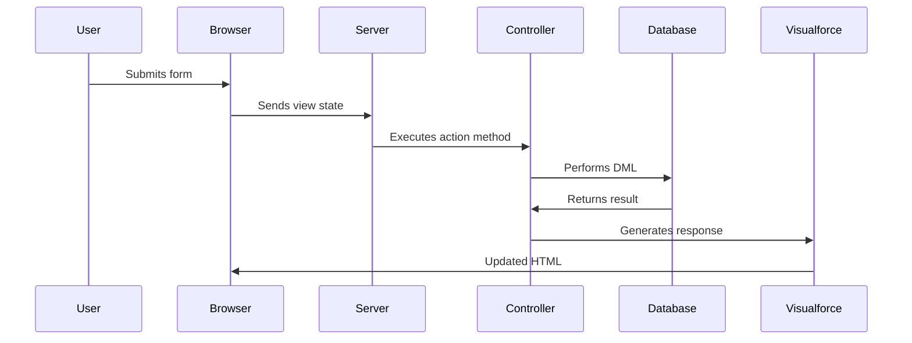

## 1. Introduction to Visualforce <a name="introduction"></a>
**Visualforce** is Salesforce's original framework for building custom user interfaces:
- Server-side markup language similar to HTML
- Tag-based structure with over 150 built-in components
- Tightly integrated with Apex for business logic
- Supports custom single-page applications
- Renders as HTML, PDF, or XML

### Key Features:
- **Custom UI Pages**: Build pages beyond standard layouts
- **PDF Generation**: Create dynamic PDF documents
- **Mobile Support**: Responsive pages for mobile devices
- **Flexibility**: Complete control over HTML/CSS/JS
- **ISV Solutions**: Package and distribute custom UIs

### When to Use Visualforce:
- Creating complex custom interfaces
- Building printable reports (PDF)
- Developing custom mobile experiences
- Integrating third-party JavaScript libraries
- Extending Salesforce with custom functionality

### Visualforce vs. Lightning Web Components:
| Feature          | Visualforce                | LWC                      |
|------------------|----------------------------|--------------------------|
| Architecture     | Server-side rendering      | Client-side rendering    |
| Performance      | Moderate                   | High                     |
| Learning Curve   | HTML-like syntax           | Modern JavaScript        |
| Mobile Support   | Responsive design needed   | Mobile-first             |
| Future-Proof     | Maintenance mode           | Strategic direction      |

---

## 2. Visualforce Architecture <a name="architecture"></a>
### How Visualforce Works:


### Key Components:
1. **Visualforce Pages** (.page): UI definition
2. **Controllers**: Apex classes for business logic
3. **Components**: Reusable UI elements
4. **View State**: Page state serialization
5. **Metadata API**: Deployment mechanism

---

## 3. Page Structure and Syntax <a name="syntax"></a>
### Basic Page Template:
```html
<apex:page controller="MyController">
    <!-- Page Header -->
    <apex:sectionHeader title="Account Manager"/>
    
    <!-- Form -->
    <apex:form>
        <!-- Page Content -->
        <apex:pageBlock title="Account Details">
            <apex:pageBlockSection>
                <apex:inputField value="{!account.Name}"/>
                <apex:inputField value="{!account.Industry}"/>
            </apex:pageBlockSection>
            
            <!-- Buttons -->
            <apex:pageBlockButtons>
                <apex:commandButton action="{!save}" value="Save"/>
            </apex:pageBlockButtons>
        </apex:pageBlock>
    </apex:form>
</apex:page>
```

### Key Elements:
- `<apex:page>`: Root container
- `<apex:form>`: Required for stateful operations
- `<apex:pageBlock>`: Structured content container
- `<apex:inputField>`: Bound to SObject fields
- `<apex:commandButton>`: Triggers controller actions

### Page Attributes:
```html
<apex:page
    controller="MyController"
    sidebar="false"
    showHeader="true"
    standardStylesheets="false"
    applyHtmlTag="false"
    docType="html-5.0">
```

---

## 4. Controllers and Extensions <a name="controllers"></a>
### Controller Types:
1. **Standard Controllers**:
   - Automatic CRUD operations
   - Built-in actions (save, edit, delete)
   ```html
   <apex:page standardController="Account">
       <h1>{!account.Name}</h1>
   </apex:page>
   ```

2. **Custom Controllers**:
   - Full control over logic
   - Implement custom navigation
   ```apex
   public class AccountController {
       public Account account { get; set; }
       
       public AccountController() {
           account = [SELECT Name, Industry FROM Account LIMIT 1];
       }
   }
   ```

3. **Controller Extensions**:
   - Add functionality to standard controllers
   - Reusable across objects
   ```apex
   public class AccountExtension {
       private final Account acc;
       
       public AccountExtension(ApexPages.StandardController stdCtrl) {
           this.acc = (Account)stdCtrl.getRecord();
       }
       
       public String getGreeting() {
           return 'Hello ' + acc.Name;
       }
   }
   ```
   ```html
   <apex:page standardController="Account" extensions="AccountExtension">
       <h1>{!greeting}</h1>
   </apex:page>
   ```

### Controller Lifecycle:
1. Constructor executes
2. Getter methods called
3. Action methods execute on user interaction
4. Page re-renders

---

## 5. Standard Components <a name="components"></a>
### Data Components:
| Component          | Purpose                          |
|--------------------|----------------------------------|
| `<apex:dataTable>` | Render data in table format      |
| `<apex:dataList>`  | Render as unordered list         |
| `<apex:repeat>`    | Iterate over collections         |
| `<apex:outputText>`| Display text with formatting     |

### Form Components:
| Component          | Purpose                          |
|--------------------|----------------------------------|
| `<apex:inputText>` | Text input field                 |
| `<apex:selectList>`| Dropdown selection               |
| `<apex:selectCheckboxes>` | Multi-select checkboxes      |
| `<apex:inputFile>` | File upload control              |

### Action Components:
| Component          | Purpose                          |
|--------------------|----------------------------------|
| `<apex:commandButton>` | Execute controller action      |
| `<apex:commandLink>`   | Action hyperlink               |
| `<apex:actionSupport>` | Add AJAX support to elements   |
| `<apex:actionPoller>`  | Periodic action execution      |

### Example: AJAX Form
```html
<apex:form>
    <apex:inputText value="{!searchTerm}"/>
    <apex:commandButton value="Search" rerender="resultsPanel">
        <apex:actionSupport event="onkeyup" rerender="resultsPanel"/>
    </apex:commandButton>
    
    <apex:outputPanel id="resultsPanel">
        <!-- Search results update without page refresh -->
    </apex:outputPanel>
</apex:form>
```

---

## 6. Custom Components <a name="custom-components"></a>
### Creating Custom Components:
1. Define component (.component file)
2. Declare attributes
3. Implement rendering logic

**Example Component:**
```html
<!-- CustomGreeting.component -->
<apex:component>
    <apex:attribute name="username" type="String" required="true"
                    description="User's name"/>
    <div class="greeting">
        Hello, <strong>{!username}</strong>!
    </div>
</apex:component>
```

**Usage in Page:**
```html
<apex:page>
    <c:CustomGreeting username="John Doe"/>
</apex:page>
```

### Component Controllers:
```html
<!-- Counter.component -->
<apex:component controller="CounterController">
    <apex:attribute name="initialValue" type="Integer" default="0"/>
    <apex:outputText value="{!count}"/>
    <apex:commandButton value="Increment" action="{!increment}"/>
</apex:component>
```

```apex
public class CounterController {
    public Integer count { get; set; }
    
    public CounterController() {
        count = 0;
    }
    
    public void increment() {
        count++;
    }
}
```

---

## 7. Data Binding and Forms <a name="data-binding"></a>
### Data Binding Syntax:
```html
<!-- Display value -->
<apex:outputText value="{!account.Name}"/>

<!-- Input binding -->
<apex:inputText value="{!searchKeyword}"/>

<!-- Action binding -->
<apex:commandButton action="{!saveRecord}" value="Save"/>
```

### Form Processing Flow:


### View State Management:
- Serializes page state between requests
- Limited to 135KB
- Optimization techniques:
  ```html
  <apex:page readonly="true"> <!-- Disable view state -->
  <apex:pageBlock mode="edit"> <!-- Optimized rendering -->
  ```

---

## 8. Visualforce and Apex Integration <a name="apex"></a>
### Accessing Data:
```apex
public class ContactController {
    public List<Contact> contacts { get; set; }
    
    public ContactController() {
        contacts = [SELECT Name, Email FROM Contact LIMIT 100];
    }
    
    public void updateContacts() {
        update contacts;
    }
}
```

```html
<apex:page controller="ContactController">
    <apex:form>
        <apex:dataTable value="{!contacts}" var="con">
            <apex:column headerValue="Name">
                <apex:inputText value="{!con.Name}"/>
            </apex:column>
            <apex:column headerValue="Email">
                <apex:inputText value="{!con.Email}"/>
            </apex:column>
        </apex:dataTable>
        <apex:commandButton action="{!updateContacts}" value="Save"/>
    </apex:form>
</apex:page>
```

### Generating PDFs:
```html
<apex:page renderAs="pdf" controller="InvoiceController">
    <h1>Invoice #{!invoiceNumber}</h1>
    <!-- PDF-specific styling -->
    <style>
        body { font-family: Arial; }
        table { width: 100%; }
    </style>
</apex:page>
```

---

## 9. JavaScript Integration <a name="javascript"></a>
### Using JavaScript Remoting:
```apex
public class RemoteController {
    @RemoteAction
    public static String processData(String input) {
        return 'Processed: ' + input;
    }
}
```

```html
<script>
Visualforce.remoting.Manager.invokeAction(
    '{!$RemoteAction.RemoteController.processData}',
    'Hello',
    function(result, event) {
        if(event.status) {
            alert(result);
        }
    }
);
</script>
```

### jQuery Integration:
```html
<apex:includeScript value="https://code.jquery.com/jquery-3.6.0.min.js"/>
<script>
jQuery(document).ready(function($) {
    $('#myButton').click(function() {
        $.ajax({
            url: '{!$Page.MyEndpoint}',
            success: function(data) {
                $('#result').html(data);
            }
        });
    });
});
</script>
```

### ActionFunction Example:
```html
<apex:actionFunction name="refreshData" action="{!refresh}" rerender="dataPanel"/>

<script>
function autoRefresh() {
    refreshData();
    setTimeout(autoRefresh, 60000); // Refresh every minute
}
autoRefresh();
</script>
```

---

## 10. Styling and UI Design <a name="styling"></a>
### CSS Integration:
```html
<apex:page>
    <apex:stylesheet value="{!URLFOR($Resource.MyStyles, 'css/main.css')}"/>
    <div class="custom-container">
        <!-- Styled content -->
    </div>
</apex:page>
```

### SLDS Integration:
```html
<apex:page standardStylesheets="false" sidebar="false">
    <apex:slds />
    <div class="slds-scope">
        <div class="slds-card">
            <!-- SLDS-styled content -->
        </div>
    </div>
</apex:page>
```

### Responsive Design:
```html
<meta name="viewport" content="width=device-width, initial-scale=1"/>
<style>
@media (max-width: 768px) {
    .desktop-only { display: none; }
    .mobile-view { width: 100%; }
}
</style>
```

---

## 11. Visualforce in Lightning Experience <a name="lightning"></a>
### Embedding Visualforce:
1. **Lightning Pages**:
   ```html
   <iframe src="/apex/MyVisualforcePage" width="100%" height="500px"/>
   ```

2. **Quick Actions**:
   - Create Visualforce quick action
   - Add to page layouts

3. **Custom Tabs**:
   - Create Visualforce tab
   - Add to app navigation

### Lightning Out:
```html
<apex:page>
    <apex:includeLightning />
    <div id="lightningContainer"></div>
    <script>
    $Lightning.use("c:MyLightningApp", function() {
        $Lightning.createComponent("c:lwcComponent",
            {},
            "lightningContainer",
            function(cmp) { /* callback */ }
        );
    });
    </script>
</apex:page>
```

### Communication Between VF and LWC:
```javascript
// In Visualforce
window.postMessage({ type: 'VF_MESSAGE', data: payload }, '*');

// In LWC
window.addEventListener('message', event => {
    if(event.data.type === 'VF_MESSAGE') {
        // Handle message
    }
});
```

---

## 12. Security Considerations <a name="security"></a>
### Key Security Features:
1. **CRUD/FLS Enforcement**:
   - Use `<apex:inputField>` for automatic checks
   - Manual enforcement with Apex:
     ```apex
     if(Schema.sObjectType.Account.fields.Name.isUpdateable()) {
         acc.Name = newName;
     }
     ```

2. **Cross-Site Scripting (XSS)**:
   - Escape output with `HTMLENCODE`:
     ```html
     <apex:outputText value="{!HTMLENCODE(userInput)}"/>
     ```

3. **CSRF Protection**:
   - Built-in token verification
   - Required for stateful forms

4. **Remote Site Settings**:
   - Whitelist endpoints for callouts
   - Setup → Remote Site Settings

---

## 13. Testing and Debugging <a name="testing"></a>
### Testing Visualforce Controllers:
```apex
@isTest
private class MyControllerTest {
    @isTest
    static void testPageLoad() {
        // Create test data
        Account testAcc = new Account(Name='Test');
        insert testAcc;
        
        // Set current page
        PageReference pageRef = Page.MyPage;
        Test.setCurrentPage(pageRef);
        
        // Instantiate controller
        MyController ctrl = new MyController();
        
        // Verify data
        System.assertEquals('Test', ctrl.account.Name);
    }
}
```

### Debugging Techniques:
1. **System.debug()**:
   ```apex
   System.debug('Account ID: ' + acc.Id);
   ```

2. **Debug Parameters**:
   ```url
   /apex/MyPage?core.apexpages.debug=1
   ```

3. **View State Inspector**:
   ```url
   /apex/MyPage?core.apexpages.developmode=1
   ```

4. **Browser Tools**:
   - Inspect HTML output
   - Monitor network requests
   - Console logging

---

## 14. Performance Optimization <a name="performance"></a>
### Optimization Strategies:
1. **View State Reduction**:
   - Use `transient` variables:
     ```apex
     transient DateTime lastRefresh;
     ```
   - Limit data in collections
   - Disable view state when possible

2. **SOQL Optimization**:
   - Selective WHERE clauses
   - LIMIT results
   - Avoid SOQL in loops

3. **Caching**:
   ```html
   <apex:page cache="true" expires="300"> <!-- 5 minutes -->
   ```

4. **Lazy Loading**:
   ```apex
   public List<Contact> getContacts() {
       if(contacts == null) {
           contacts = [SELECT Name FROM Contact];
       }
       return contacts;
   }
   ```

---

## 15. Governor Limits <a name="limits"></a>
### Key Visualforce Limits:
| Resource               | Limit                         |
|------------------------|-------------------------------|
| View State Size        | 135KB                         |
| Concurrent Users       | Varies by org type            |
| Heap Size              | 6MB (synchronous) / 12MB (async)|
| SOQL Queries           | 100 (synchronous)             |
| DML Statements         | 150 (synchronous)             |
| Component Tree Depth   | 1,600 components              |

### Best Practices for Limits:
- Monitor view state size
- Use pagination for large datasets
- Offload processing to async Apex
- Optimize SOQL queries
- Use read-only mode when possible

---

## 16. Best Practices <a name="best-practices"></a>
### Development Practices:
1. **MVC Separation**:
   - Keep business logic in controllers
   - Presentation in Visualforce
   - Data access in separate layers

2. **Component Reusability**:
   - Create custom components
   - Use composition over duplication

3. **Error Handling**:
   ```html
   <apex:pageMessages/>
   ```
   ```apex
   try {
       update accounts;
   } catch(DmlException e) {
       ApexPages.addMessage(new ApexPages.Message(
           ApexPages.Severity.ERROR, 
           e.getMessage()
       ));
   }
   ```

### Performance Practices:
- Minimize view state
- Use static resources for assets
- Implement pagination
- Cache frequently used data

---

## 17. Migration to LWC <a name="migration"></a>
### Migration Strategies:
1. **Coexistence**:
   - Wrap Visualforce in LWC via iframe
   - Embed LWC in Visualforce via Lightning Out

2. **Progressive Rewrite**:
   - Identify independent components
   - Rewrite component-by-component
   - Maintain shared data layer

3. **Full Rewrite**:
   - Redesign UI with LWC
   - Reuse backend Apex logic
   - Implement modern UX patterns

### Migration Tools:
- **Lightning Web Security**: Run Visualforce in secure sandbox
- **Salesforce CLI Scanner**: Identify compatibility issues
- **Visualforce Remoting Converter**: Convert to Apex wire adapters

---

## 18. Resources <a name="resources"></a>
### Official Documentation:
- [Visualforce Developer Guide](https://developer.salesforce.com/docs/atlas.en-us.pages.meta/pages/)
- [Visualforce Component Reference](https://developer.salesforce.com/docs/atlas.en-us.pages.meta/pages/pages_compref.htm)

### Learning Platforms:
- Trailhead: [Visualforce Basics](https://trailhead.salesforce.com/content/learn/modules/visualforce_fundamentals)
- Salesforce Ben: [Visualforce Tutorials](https://www.salesforceben.com/salesforce-visualforce-tutorial/)

### Tools:
- [Visualforce Development Guide (PDF)](https://resources.docs.salesforce.com/226/latest/en-us/sfdc/pdf/salesforce_visualforce_developers_guide.pdf)
- [VS Code Salesforce Extension Pack](https://marketplace.visualstudio.com/items?itemName=salesforce.salesforcedx-vscode)

### Books:
- "Visualforce Development Cookbook" by Keir Bowden
- "Advanced Visualforce" by Dan Appleman
