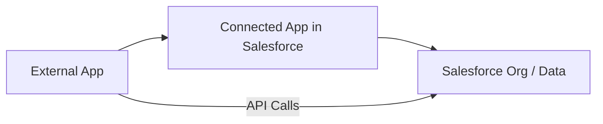
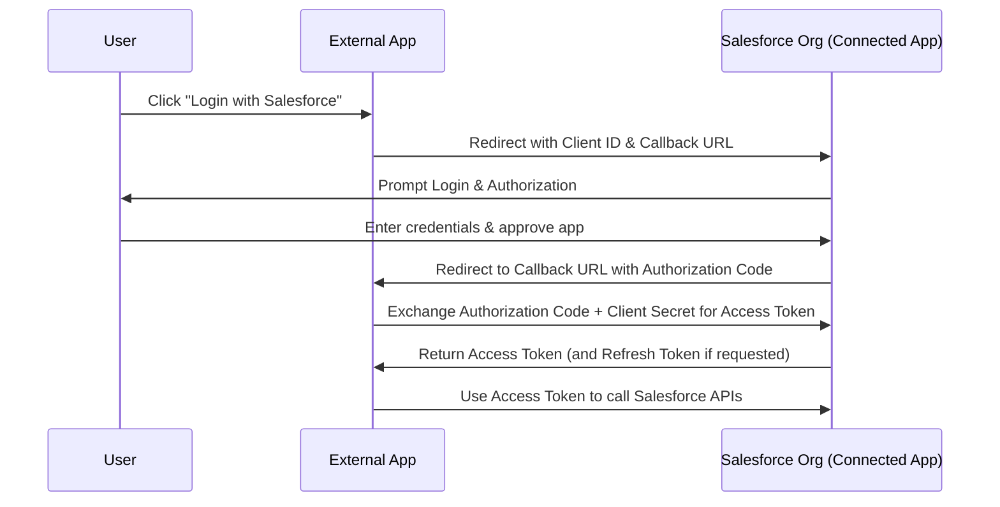
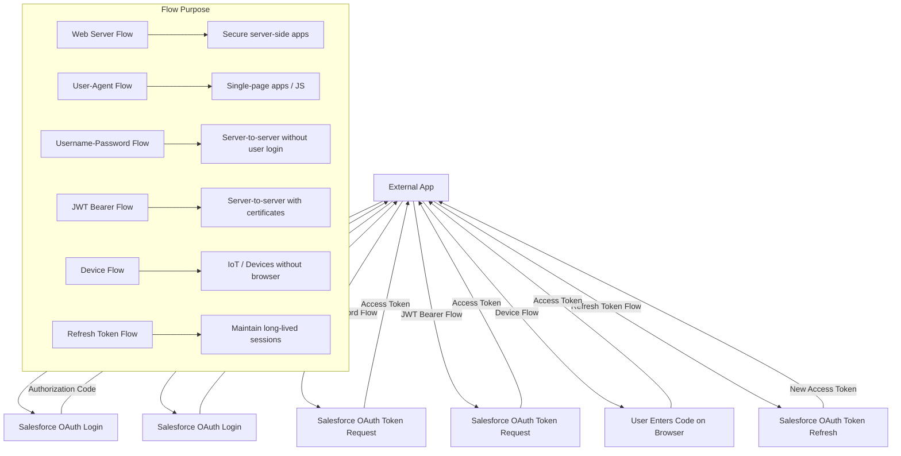
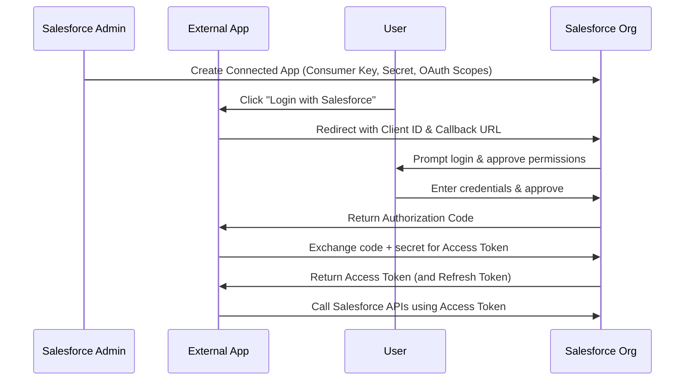

## 1. **What is a Connected App?**

A **Connected App** is a framework in Salesforce that enables **integration** between Salesforce and external applications by using **APIs and standard protocols**.

- **Purpose:**
    
    - Allow external apps to connect to Salesforce securely.
        
    - Enable OAuth authentication for secure API access.
        
    - Control permissions, policies, and data access for external clients.
        
- **Examples:**
    
    - A mobile app that needs Salesforce data.
        
    - Middleware like MuleSoft or integration tools.
        
    - Single Sign-On (SSO) with third-party identity providers.
        

---

## 2. **Key Concepts**

|Term|Meaning|
|---|---|
|**Consumer Key**|Unique ID for the connected app (like a username for OAuth).|
|**Consumer Secret**|Password equivalent for the connected app (used in OAuth).|
|**Callback URL**|The endpoint in your external app that Salesforce sends the OAuth response to.|
|**OAuth Scopes**|Define what the connected app can do (e.g., full access, read-only, refresh tokens).|
|**Profiles & Permission Sets**|Control which Salesforce users can use this connected app.|
|**Policies**|Define login, IP, and session security for the connected app.|

---

## 3. **Where Connected Apps Fit in Salesforce Architecture**

```
[External App] <--OAuth/API--> [Connected App] --> [Salesforce Org]
```

1. **External App** (could be a web app, mobile app, or service).
    
2. **Connected App** (created in Salesforce to handle authentication & permissions).
    
3. **Salesforce Org** (where the data lives).
    

---

## 4. **Creating a Connected App (Step-by-Step)**

1. **Navigate to Setup** → **App Manager** → **New Connected App**.
    
2. **Basic Info**:
    
    - Name, API Name, Contact Email.
        
3. **API (Enable OAuth Settings)**:
    
    - **Enable OAuth Settings** checkbox.
        
    - Set **Callback URL**.
        
    - Select **OAuth Scopes** (e.g., `Full access (full)`, `Access and manage your data (api)`).
        
4. **Policies**:
    
    - IP Relaxation: Enforce IP restrictions or relax them.
        
    - Session Policies: Determine how sessions are handled.
        
5. **Save**:
    
    - Salesforce generates **Consumer Key** & **Consumer Secret**.
        
6. **Manage Access**:
    
    - Assign to profiles or permission sets.
        

---

## 5. **OAuth Flows Supported**

Connected Apps support different **OAuth 2.0 flows** depending on the use case:

|Flow|Use Case|
|---|---|
|**Web Server Flow**|For apps running on a secure server, where client secret can be stored safely.|
|**User-Agent Flow**|For single-page apps (JavaScript) that can’t securely store secrets.|
|**Username-Password Flow**|Server-to-server integration without user interaction (not recommended for high security).|
|**JWT Bearer Flow**|Server-to-server integration with certificates.|
|**Device Flow**|For devices without browsers (e.g., IoT).|
|**Refresh Token Flow**|To maintain long-lived sessions without re-login.|

---

## 6. **OAuth Scope Examples**

|Scope|Purpose|
|---|---|
|**api**|Access and manage Salesforce data.|
|**refresh_token**|Refresh access without re-login.|
|**full**|Full access to the org.|
|**id**|Access user identity info.|
|**web**|Allow web-based access.|
|**custom_permissions**|Access custom permissions defined in Salesforce.|

---

## 7. **Authentication & Authorization Flow (Example)**

**Web Server OAuth Flow:**

1. **External App → Salesforce**: Redirect user to Salesforce login page.
    
2. **User** logs in & grants permissions.
    
3. **Salesforce → External App**: Sends authorization code to callback URL.
    
4. **External App → Salesforce**: Exchanges authorization code + client secret for an **access token**.
    
5. **External App** uses **access token** to call Salesforce APIs.
    

---

## 8. **Managing Connected Apps**

- **View in App Manager**: Edit, delete, or view details.
    
- **Manage Profiles/Permission Sets**: Control which users can authorize.
    
- **Revoke Tokens**: Force logout for all sessions.
    
- **View Usage Logs**: Monitor API calls and logins.
    

---

## 9. **Security Considerations**

- **Always Use HTTPS** for Callback URLs.
    
- **Restrict IP ranges** when possible.
    
- **Use Least Privilege Scopes** (don’t give `full` if `api` is enough).
    
- **Rotate Consumer Secrets** periodically.
    
- **Enable High Assurance Sessions** for sensitive apps.
    
- **JWT Flow with Certificates** for secure server-to-server integrations.
    

---

## 10. **Common Use Cases**

- **SSO Integration** with identity providers (Okta, Azure AD, Google Workspace).
    
- **Mobile App Authentication** (Salesforce Mobile SDK).
    
- **API Integration** for backend services.
    
- **External Data Visualization** in dashboards pulling from Salesforce.
    

---

## 11. **Connected App vs. Named Credential vs. Auth Provider**

|Feature|Connected App|Named Credential|Auth Provider|
|---|---|---|---|
|**Purpose**|Handle authentication for external apps to connect to Salesforce.|Store authentication & endpoint details for calling out from Salesforce.|Configure external identity providers for login.|
|**Direction**|Inbound to Salesforce.|Outbound from Salesforce.|Inbound for SSO login.|
|**Example**|External app calls Salesforce API.|Salesforce calls external REST API.|Login with Google.|

---

## 12. **Troubleshooting Tips**

- **Invalid Client ID**: Check Consumer Key.
    
- **Invalid Redirect URI**: Ensure Callback URL matches exactly.
    
- **invalid_grant**: Authorization code expired or wrong client secret.
    
- **Insufficient Scope**: Check OAuth scopes match API needs.
    
- **User not authorized**: Assign app to user’s profile or permission set.
    

---

## 13. **Exam & Interview Quick Facts**

- Connected Apps are required for **OAuth authentication**.
    
- They can be restricted by **IP** and **session policies**.
    
- **Consumer Key/Secret** are generated automatically and used for API authentication.
    
- You can **manage connected app access** via profiles/permission sets.
    
- **OAuth Scopes** define what the external app can do in Salesforce.
    
- For server-to-server integrations, **JWT Bearer Flow** is most secure.
    

---

✅ **Memory Hook:**  
Think of a Connected App as a **secure handshake** — Salesforce holds one hand (Connected App config), the external system holds the other (OAuth credentials), and both agree on what they can do together (scopes & policies).

---

# Diagrams:

### 1️⃣ Connected App Architecture



---

### 2️⃣ OAuth Web Server Flow



---

### 3️⃣ Multiple OAuth Flows Overview



---

### 4️⃣ End-to-End Setup Diagram



---
