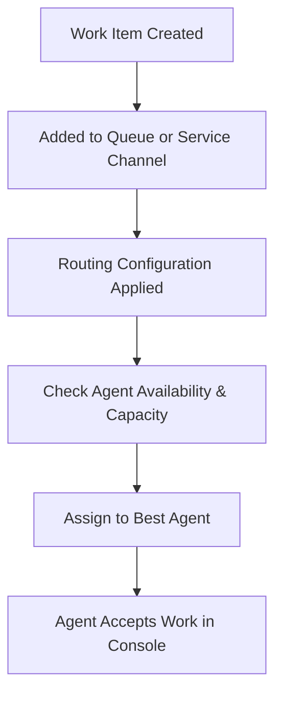

## 1. **Foundation Concepts**

### 1.1 Service Console

- **Purpose**: A workspace for agents to handle multiple customer cases, chats, or tasks efficiently.
    
- **Features**:
    
    - Tab-based navigation (records open as tabs/subtabs).
        
    - Utility bar for quick tools (notes, softphone, macros).
        
    - Supports Omni-Channel integration for real-time work distribution.
        

### 1.2 Queues

- **Definition**: Virtual containers that hold records (Cases, Leads, custom objects) waiting to be assigned.
    
- **Role in Omni-Channel**:
    
    - Omni-Channel uses queues as “entry points” for routing work.
        
    - Agents assigned to a queue are eligible to receive work from that queue.
        

---

## 2. **What is Omni-Channel?**

- **Definition**: A Salesforce feature that **intelligently routes work** to the most suitable, available agent in real-time.
    
- **Goal**: Deliver the right work, to the right agent, at the right time.
    
- **Benefits**:
    
    - Balances workload between agents.
        
    - Reduces wait times for customers.
        
    - Increases agent productivity and case resolution speed.
        

---

## 3. **Key Routing Types**

|Routing Type|How it Works|Best For|
|---|---|---|
|**Queue-based Routing**|Assigns work from queues to agents with availability.|Simple distribution where all agents have equal skills.|
|**Skill-based Routing**|Matches work to agents with specific skills (e.g., language, product expertise).|Cases needing specialized handling.|
|**External Routing**|Routes work from external systems into Salesforce using APIs.|Integrations with third-party routing engines.|
|**Attribute-based Routing**|Matches work using multiple attributes (skills, availability, capacity).|More complex routing scenarios.|

---

## 4. **Core Concepts in Omni-Channel**

### 4.1 Routing Configurations

- Define **how work is assigned**.
    
- Contains:
    
    - **Routing Priority**: Lower number = higher priority.
        
    - **Routing Model**:
        
        - _Most Available_: Agent with the most capacity.
            
        - _Least Active_: Agent with fewest open work items.
            
        - _External Routing_: For third-party systems.
            

### 4.2 Service Channels

- Connect a Salesforce object (Case, Lead, custom object) to Omni-Channel.
    
- Define the “type” of work that will be routed.
    

### 4.3 Presence Statuses

- Indicators of an agent’s availability.
    
- Types:
    
    - **Online statuses** (e.g., Available for Cases, Available for Chat).
        
    - **Offline statuses** (e.g., Offline, Break).
        
- Customizable for different work types.
    

### 4.4 Agent Capacity Model

- **Capacity**: A measure of how much work an agent can handle at once.
    
- Two ways to set:
    
    1. **Capacity-based**: Work is assigned until capacity is full (each work item consumes capacity).
        
    2. **Decline-based**: Agent manually accepts or declines work.
        

---

## 5. **Omni-Channel Flow (Routing Steps)**

---

## 6. **Setup Steps (Admin Perspective)**

1. **Enable Omni-Channel**
    
    - Setup → Omni-Channel Settings → Enable.
        
2. **Create Service Channels**
    
    - Setup → Service Channels → New.
        
    - Map to Salesforce object.
        
3. **Configure Routing Configurations**
    
    - Define priority, routing model, and capacity usage.
        
4. **Set Up Queues (if Queue-based)**
    
    - Add supported objects and assign agents.
        
5. **Create Presence Statuses**
    
    - E.g., “Available for Cases,” “Available for Chat.”
        
6. **Assign Presence Configurations to Users**
    
    - Controls capacity and what statuses they can use.
        
7. **Add Omni-Channel to Service Console App**
    
    - Add **Omni-Channel Utility** to the console app’s Utility Bar.
        

---

## 7. **Advanced Features**

- **Omni Supervisor**: Real-time monitoring of agent workload and queues.
    
- **Push Timeout**: If an agent doesn’t accept work in X seconds, reassign.
    
- **Work Item Size**: Assign different “capacity weights” to different work types.
    
- **Interruptible Work**: Allows higher-priority work to replace lower-priority work.
    
- **Pre-Chat Forms**: Capture data before routing chat requests.
    

---

## 8. **Best Practices**

- Clearly define agent skills and match them to work types.
    
- Set realistic agent capacity to avoid burnout.
    
- Use priorities wisely — don’t make everything “Priority 1”.
    
- Monitor performance using **Omni Supervisor**.
    
- Regularly review routing rules as business needs change.
    

---

## 9. **Common Exam/Interview Points**

- Omni-Channel is **not** just for Cases — can route Leads, custom objects, and external work.
    
- **Routing happens before assignment** — agents don’t “pick” cases manually.
    
- Presence statuses are linked to **Presence Configurations**, which define what work agents can receive.
    
- You must add the **Omni-Channel widget** to the Service Console Utility Bar for agents to receive work.
    
